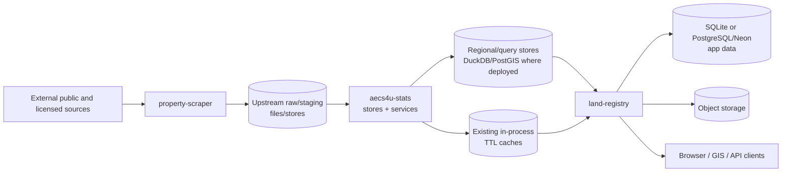

# Land Registry — Cadastral & Territorial Intelligence Platform
## Software Requirements Specification (SRS) — Existing Application with Upstream Data Boundaries

**Version:** 1.3  
**Date:** 2026-09-03  
**Reference application studied:** `https://app.zornade.com/?lat=41.971743&lng=11.678467&zoom=8`  
**Primary public product site:** `https://zornade.com/`

---

## 1. Purpose

This document captures the observable and publicly documented requirements of the Zornade web platform and its closely integrated platform features, adapted as a product/engineering requirements document for evolving the existing `land-registry` application around three logical responsibilities. Only `land-registry` is implemented in this repository; acquisition and consolidation are upstream integrations:

- **`property-scraper`** — external data acquisition and raw/staging persistence;
- **`aecs4u-stats`** — data normalization, consolidation, spatial enrichment, statistics and canonical read APIs;
- **`land-registry`** — web GUI, interactive maps, data visualization and user-facing workflows.

The target product is a **map-first Italian cadastral intelligence platform** that allows a user to:

1. locate a place or cadastral parcel;
2. inspect the parcel geometry;
3. aggregate cadastral, environmental, market, demographic, building, land-use and risk data into one parcel profile;
4. visualize thematic layers on an interactive map;
5. save, annotate and export parcels;
6. contribute field/community observations;
7. validate observations submitted by other users;
8. expose the same underlying data via REST APIs and GIS integrations.

---

## 2. Research Basis and Confidence

The application itself is JavaScript-heavy. This specification therefore combines:

- the public crawlable shell of `app.zornade.com`;
- official Zornade product pages;
- official Zornade API documentation/catalog;
- official Zornade blog posts describing workflows and map layers;
- the public leaderboard;
- the public authentication page;
- public Zornade GitHub documentation for ecosystem/integration details.

### 2.1 Requirement confidence labels

Requirements are tagged with one of:

- **[VERIFIED]** — directly exposed or explicitly documented by Zornade.
- **[ADVERTISED]** — described on an official Zornade product page but not independently exercised in the dynamic UI.
- **[INFERRED]** — required to reproduce the observed behavior, but implementation details are not publicly confirmed.
- **[RECOMMENDED]** — engineering recommendation for a production-quality reimplementation.

### 2.2 Known documentation inconsistencies

The current public material is not completely internally consistent:

- several pages advertise **20 enriched data blocks**;
- the current public data-catalog index enumerates **21 entries**, with VIIRS night-light data appearing as an additional block;
- some API-facing UI examples show **1,000 requests/hour**, while the current API documentation states **10,000 requests/hour per token**.

A reimplementation should therefore make these limits/configuration values server-controlled and avoid hard-coding marketing numbers in the frontend.

---

# 3. Product Scope

## 3.1 In scope

The product SHALL provide:

- nationwide cadastral map browsing;
- address/geographic/cadastral search;
- parcel identification and selection;
- enriched parcel profiles;
- thematic territorial layers;
- OMI real-estate valuation data;
- environmental and natural-risk information;
- terrain and land-use information;
- demographic/economic information;
- building and photovoltaic information;
- saved parcels, notes and tags;
- exports;
- user authentication plus guest/incognito access;
- community reports and validation;
- XP, levels, badges and leaderboard;
- public REST API; scoped developer API tokens are an optional future capability;
- GIS-friendly geometry/data outputs;
- privacy, provenance and source attribution.

## 3.2 Out of scope

Unless added as a separate integration, the product SHALL NOT claim to provide:

- legally valid cadastral title/ownership certification;
- an official cadastral visura equivalent to SISTER;
- guaranteed title ownership data from public map geometry alone;
- a legal substitute for municipal planning certificates, CDU, PAI extracts, deeds or professional due diligence.

## 3.3 Technology and dependency selection policy

This repository already contains the `land-registry` application and consumes the
`aecs4u-domain`, `aecs4u-auth`, `aecs4u-storage` and `aecs4u-stats` packages. The
acquisition pipeline (`property-scraper`) is upstream and outside this repository.
This SRS therefore SHALL NOT prescribe replacement frameworks or introduce new runtime
dependencies solely because they are mentioned as examples in this document.

### 3.3.1 Requirements are capability-based

Requirements in this document SHALL primarily specify:

- required behavior;
- interfaces and contracts;
- data ownership;
- performance and reliability objectives;
- security constraints;
- deployment constraints;
- interoperability requirements.

Specific Python libraries, frameworks, services, databases extensions, map engines, task orchestrators, caches, storage formats, or supporting products mentioned in this document SHALL be treated as **implementation candidates only**, unless a dependency is explicitly identified as an existing project constraint.

### 3.3.2 Existing package implementations take precedence

Before adding, replacing, or upgrading a dependency, the implementation team SHALL first review:

1. the package's current dependency graph;
2. existing abstractions and implementation capabilities;
3. compatibility with `aecs4u-domain`;
4. whether the requirement can be satisfied using an already-adopted dependency;
5. migration and regression risk.

No new dependency SHALL be introduced merely to align the implementation with an example technology stack in this SRS.

### 3.3.3 Cost-benefit analysis requirement

A material new dependency or architectural component SHOULD be adopted only after an implementation-time cost-benefit analysis.

The analysis SHOULD consider, as applicable:

- functional fit;
- performance;
- scalability;
- memory/CPU requirements;
- PostgreSQL/PostGIS compatibility;
- integration effort;
- migration effort;
- operational complexity;
- cloud/runtime cost;
- development velocity;
- team familiarity;
- testing burden;
- maintenance activity and project health;
- long-term support;
- security history;
- dependency/transitive-dependency footprint;
- licensing;
- vendor lock-in;
- portability;
- observability;
- failure modes;
- availability of simpler alternatives already present in the codebase.

The decision MAY be documented as an Architecture Decision Record (ADR).

### 3.3.4 Dependency classification

Technologies mentioned in this SRS SHALL be interpreted using these categories:

- **Existing constraint** — already part of the established architecture and may be treated as required.
- **Candidate** — potentially useful implementation option requiring review.
- **Optional enhancement** — may be introduced only where measurable benefit justifies the additional complexity.
- **Example only** — illustrates a possible implementation and creates no dependency requirement.

### 3.3.5 Current architectural constraints

The following are treated as established constraints for this repository:

- `land_registry` is the current Python package and `land-registry` is its distribution/CLI name;
- `aecs4u-stats`/`aecs4u_stats` is an existing upstream dependency consumed through `land_registry/stats_service.py`;
- `aecs4u-domain` provides shared domain models upstream, including the cadastral model that is not yet the sole storage path in this application;
- cadastral files are currently read from local storage or object storage (primarily S3), with FlatGeobuf, GeoPackage, GeoJSON and related formats in use;
- SQLite/SpatiaLite remains a supported local/test and legacy cadastral path;
- some application databases have been migrated to PostgreSQL/Neon, while PostgreSQL/PostGIS is an available target for high-volume spatial publication rather than an already universal replacement for every current store;
- the application currently exposes FastAPI routes under `/api/v1`, plus HTML and Panel/Bokeh surfaces.

The `property-scraper` responsibility is upstream of this repository. It SHALL be
treated as an external data producer unless a separate checkout/package is explicitly
added. All references to `aecs4u-stats` in this SRS refer to the existing upstream
distribution/import package.

All other named libraries in this document SHALL be reviewed at implementation time unless independently established as existing project dependencies.

## 3.4 Actual package and integration architecture

This repository SHALL remain one independently deployable `land-registry` application.
The three responsibilities below are integration boundaries, not a requirement to
split this repository into three new packages:

| Package | Primary responsibility | Owns | Must not own |
|---|---|---|---|
| `property-scraper` (upstream) | Data acquisition | crawlers, downloaders, source adapters, raw payloads/files, ingestion metadata | canonical business entities, GUI, user state |
| `aecs4u-stats` (upstream dependency) | Data consolidation and intelligence | normalization, spatial/statistical enrichment, query services and reusable data stores | browser UI, source crawling, user workflows |
| `land-registry` (this repository) | Web application and visualization | FastAPI routes, map/UI, file/object-storage integration, application workflows and user-facing exports | upstream scraping and national-scale ETL |

### 3.4.1 Dependency rule

The packages SHALL NOT form circular Python dependencies.

Preferred dependency/data direction:

```text
External Sources
      |
      v
property-scraper
      |
      | raw/staging datasets + ingestion manifests
      v
aecs4u-stats
      |
      | canonical/enriched records + read API
      v
land-registry
      |
      v
End Users / GIS Clients
```

`land-registry` SHALL NOT import scraper spiders or source-specific acquisition code.

`property-scraper` SHALL NOT depend on `land-registry`.

`aecs4u-stats` SHALL be the authoritative upstream boundary between consolidated data
and this application. `land-registry` SHALL consume its public interfaces and existing
storage/query abstractions rather than importing private implementation details.

### 3.4.2 Storage ownership and migration posture

The application SHALL support the current storage modes while migration proceeds:

| Data/use | Current repository path | Target direction when justified |
|---|---|---|
| Cadastral source files | Local files or S3/object storage; regional FlatGeobuf/GeoPackage paths | Keep object storage as the artifact layer; add a canonical spatial store only where query/latency benefits justify it |
| Cadastral query data | `aecs4u-stats` regional stores plus legacy SQLite/SpatiaLite and in-memory GeoDataFrame paths | Make the upstream parcel query service the preferred path; retire legacy paths only after parity tests |
| App/user metadata | SQLite locally; PostgreSQL/Neon for deployments that have migrated | Keep a repository-owned persistence abstraction and test both supported backends until SQLite is formally retired |
| Shared domain schema | `aecs4u-domain` upstream models | Reuse the shared model; do not introduce a competing local canonical parcel schema |

PostgreSQL/PostGIS SHALL be used where the existing deployment already provides it or
where a measured workload requires it. It SHALL NOT be introduced merely to match the
reference product. A migration SHALL define data ownership, compatibility, rollback and
the source of truth for each affected table/store.

### 3.4.3 Contract rule

Cross-package integration SHALL use stable contracts, preferably:

1. database tables/views with versioned schemas;
2. Parquet/GeoParquet/JSONL artifacts plus ingestion manifests for batch interchange;
3. REST/OpenAPI interfaces for online reads;
4. event/job messages for asynchronous refresh notifications.

Package integration SHALL NOT depend on private implementation classes of another package.

### 3.4.4 Current state versus target state

The current repository is a single `land-registry` application. It contains the FastAPI
application, HTML templates, browser JavaScript, Folium/Leaflet map paths, Panel/Bokeh
tables, Datashader tile paths, file/object-storage adapters and application persistence.
It consumes `aecs4u-stats` through `land_registry/stats_service.py` and exposes the
enrichment surface under `/api/v1/enrichment/*`.

The repository currently supports more than one storage path: local SQLite/SpatiaLite
for development, tests and legacy workflows; regional `aecs4u-stats` stores; object
storage for cadastral artifacts; and PostgreSQL/Neon for deployments and databases that
have already been migrated. This is a deliberate compatibility state, not evidence that
all stores have the same schema or consistency guarantees.

The target state for this repository is evolutionary:

| Concern | Current state | Target state | Required change |
|---|---|---|---|
| Web application | One FastAPI package with server-rendered and client-rendered map paths | Keep one `land_registry` application; add new map paths beside legacy paths until parity | No package split required |
| Parcel queries | `aecs4u-stats` regional stores plus legacy loaded-GDF/SpatiaLite paths | Prefer the upstream parcel query service behind a local repository adapter | Add parity and fallback tests before retiring old paths |
| Enrichment | `stats_service.py` delegates to optional upstream stores/APIs and degrades when unavailable | Preserve one typed application-facing contract regardless of store availability | Add response models and lineage metadata |
| User/application data | SQLite locally, PostgreSQL/Neon where migrated, file/object storage for some artifacts | Keep backend selection behind existing abstractions; migrate per table/use case | Do not require a wholesale database migration |
| Acquisition | Upstream responsibility; this app reads published files/stores and does not scrape source portals | Continue consuming upstream acquisition outputs | Keep scraper credentials out of this repository |

The target SHALL NOT introduce a new `aecs4u-stats` package inside this repository. The
existing `aecs4u-stats` dependency is the integration point. A future rename or service
split requires an ADR, a compatibility period and contract tests. PostgreSQL/PostGIS,
vector tiles, a separate frontend and API-key management remain optional changes whose
value must be demonstrated against the existing implementation.

---

# 4. Primary User Personas

## P-01 — Real-estate investor / analyst
Needs rapid screening of a property for value, risk, surroundings, cadastral position and market context.

## P-02 — Surveyor / architect / engineer
Needs parcel geometry, cadastral identifiers, risk layers, terrain, constraints and GIS export.

## P-03 — Lawyer / notary / credit specialist
Needs a territorial/cadastral context around a property, while understanding that authoritative legal title data still comes from official channels.

## P-04 — Urban planner / public authority
Needs parcel-level thematic analysis, buildings, population, land use and risk layers.

## P-05 — Researcher / data scientist
Needs API access, bulk-friendly structured data, geometry and source metadata.

## P-06 — Community contributor
Needs to report real-world changes, attach evidence and validate reports submitted by others.

## P-07 — Software developer
Needs API tokens, scopes, rate-limit visibility and stable resource-oriented endpoints.

---

# 5. Core User Journeys

## J-01 — Search an address and inspect a parcel

1. User opens the map.
2. User searches an address.
3. System geocodes the address.
4. Map flies/zooms to the result.
5. System identifies parcel(s) intersecting or nearest to the point.
6. User clicks/selects a parcel.
7. Parcel geometry is highlighted.
8. Enriched profile loads.
9. Relevant thematic layers can be enabled.
10. User may save, tag, annotate or export the parcel.

## J-02 — Find a parcel from cadastral reference

1. User selects cadastral search.
2. User chooses/enters municipality.
3. User enters sheet (`foglio`).
4. User enters parcel/map number (`particella` / `mappale` / label).
5. If relevant, user enters cadastral/urban section.
6. System returns matching parcels.
7. Selecting a result centers and highlights it on the map.

## J-03 — Inspect risk before buying a property

1. Search property by address.
2. Inspect cadastral identifiers.
3. Review OMI values.
4. Enable seismic layer.
5. Enable flood layer.
6. Enable landslide layer.
7. Enable ground deformation/subsidence layer.
8. Review landscape/cultural constraints.
9. Review terrain slope/elevation.
10. Review land use and nearby context.
11. Export the result as a report.

## J-04 — Save and organize parcels

1. Authenticated user selects a parcel.
2. User saves it.
3. User adds tags.
4. User adds a note.
5. Saved item becomes visible in the Saved section.
6. User can reopen it and restore map context.

## J-05 — Submit a community observation

1. Authenticated community user selects a map position.
2. System associates the location with a parcel when possible.
3. User selects report type.
4. User enters title and description.
5. User optionally attaches a photo.
6. Report starts in a pending state.
7. Other users can confirm or contest it.
8. Server computes weighted consensus.
9. Status evolves based on consensus/expiry rules.
10. Contributor receives or loses XP according to outcome.

## J-06 — Generate and use an API key (optional future capability)

1. The developer API capability is enabled for the deployment.
2. User authenticates.
3. User opens API area.
4. User creates a token.
5. User selects scopes.
6. System displays token once or according to security policy.
7. Token is sent in `x-api-key`.
8. API returns rate-limit headers.
9. User can revoke/replace tokens.

---

# 5A. Requirement-to-Package Ownership Matrix

| Requirement area | `property-scraper` | `aecs4u-stats` | `land-registry` |
|---|---:|---:|---:|
| External source acquisition | **Primary** | Consumer | - |
| Raw file/payload retention | **Primary** | Read | - |
| Normalization/cleaning | - | **Primary** | - |
| Parcel normalization and identity resolution | - | **Primary** | Read |
| Spatial joins/enrichment | - | **Primary** | Read |
| Statistical calculations | - | **Primary** | Read |
| Dataset provenance | Capture | **Consolidate/expose** | Display |
| Data read API | - | **Primary** | Consumer |
| Address/cadastral search UI | - | Service | **Primary** |
| Interactive map | - | Layer/data provider | **Primary** |
| Parcel detail visualization | - | Data provider | **Primary** |
| Saved parcels/notes/tags | - | - | **Primary** |
| Authentication | - | Data-token validation as needed | **Primary** |
| Community reports | - | Optional read support | **Primary** |
| XP/leaderboard | - | - | **Primary** |
| PDF/CSV/GeoJSON UX | - | Data provider | **Primary** |
| Operational ingestion jobs | **Primary** | Trigger/consume | - |

The three-column matrix above describes the three logical product responsibilities.
For schema ownership, `aecs4u-domain` is an additional shared boundary:

| Shared model boundary | `aecs4u-domain` | `aecs4u-stats` | `land-registry` |
|---|---:|---:|---:|
| SQLModel/Alembic canonical cadastral entities | **Primary** | Consumer | Consumer/adapter |
| Parcel identity/version entities introduced for cross-package use | **Primary** | Consumer | API DTO consumer |
| User/application-only records not promoted to the shared domain | - | - | **Primary**, via existing backend abstractions |

At the current installed dependency version, `aecs4u-domain` exposes the canonical
`CadastralParcel` SQLModel but does not yet expose shared `ParcelIdentity`,
`ParcelVersion` or `SavedParcel` SQLModels. Those additions are an upstream domain
change; the Pydantic classes in `land_registry.models` are transport DTOs only.


# 6. Navigation and Information Architecture

**Primary package ownership:** `land-registry`  

## FR-NAV-001 [VERIFIED]
The primary navigation SHALL expose at least:

- **Map**
- **Saved**
- **Leaderboard / Classifica**
- **API**
- **Login / Account**

## FR-NAV-002 [VERIFIED]
The product SHALL support direct URLs for major application areas.

Observed examples:

- `/`
- `/saved-parcels`
- `/leaderboard`
- `/api`
- `/auth`

## FR-NAV-003 [VERIFIED]
The map SHALL accept location state in URL parameters.

Observed reference pattern:

```text
?lat=<latitude>&lng=<longitude>&zoom=<zoom>
```

## FR-NAV-004 [RECOMMENDED]
Map state SHOULD be shareable and restorable from the URL, including:

- latitude;
- longitude;
- zoom;
- selected parcel ID;
- active base map;
- active thematic layers.

## FR-NAV-005 [VERIFIED]
The application SHALL expose skip-navigation accessibility links for main content/map where applicable.

---

# 7. Interactive Map Requirements

**Primary package ownership:** `land-registry`  

## FR-MAP-001 [VERIFIED]
The application SHALL provide an interactive nationwide map of Italian cadastral parcels.

## FR-MAP-002 [VERIFIED]
Users SHALL be able to pan and zoom continuously.

## FR-MAP-003 [VERIFIED]
Parcel geometries SHALL become available/displayable according to map zoom and viewport.

## FR-MAP-004 [VERIFIED]
Clicking a parcel SHALL select it and open/load its data profile.

## FR-MAP-005 [VERIFIED]
The map SHALL display cadastral parcel labels where meaningful.

## FR-MAP-006 [VERIFIED]
The system SHALL support map navigation from an address search.

## FR-MAP-007 [VERIFIED]
The system SHALL support map navigation from coordinates.

## FR-MAP-008 [VERIFIED]
The system SHALL support map navigation from cadastral identifiers.

## FR-MAP-009 [ADVERTISED]
The system SHOULD provide overlapping thematic layers combining cadastral geometry with demographic, hazard, land-use and related territorial information.

## FR-MAP-010 [ADVERTISED]
The platform SHOULD support 45+ map layers or an equivalent extensible layer catalog.

## FR-MAP-011 [RECOMMENDED]
The layer switcher SHALL support:

- visibility toggle;
- opacity;
- legend;
- loading state;
- error state;
- source attribution;
- last-update metadata where available.

## FR-MAP-012 [RECOMMENDED]
Layer rendering SHALL be viewport/zoom-aware to prevent loading unnecessary national-scale geometry.

## FR-MAP-013 [RECOMMENDED]
Selected parcels SHALL remain visually distinct from thematic fill layers.

## FR-MAP-014 [RECOMMENDED]
The app SHOULD support a responsive desktop/tablet/mobile layout without losing core map functionality.

---

# 8. Search and Geocoding

**Primary package ownership:** `land-registry` for UX/API orchestration; `aecs4u-stats` for canonical parcel lookup and normalized geospatial search  

## FR-SEARCH-001 [VERIFIED]
The system SHALL provide free-text address search.

## FR-SEARCH-002 [VERIFIED]
Direct geocoding SHALL return candidate addresses with:

- street name;
- street number;
- municipality;
- province;
- region;
- latitude;
- longitude;
- formatted address.

## FR-SEARCH-003 [VERIFIED]
Address search SHALL optionally support city/municipality filtering.

## FR-SEARCH-004 [VERIFIED]
The system SHALL support reverse geocoding from coordinates.

## FR-SEARCH-005 [VERIFIED]
Reverse geocoding SHALL allow a search radius.

## FR-SEARCH-006 [VERIFIED]
The cadastral search SHALL support municipality and sheet (`foglio`).

## FR-SEARCH-007 [VERIFIED]
The enriched API/search model SHALL support parcel label/mappale and cadastral section where available.

## FR-SEARCH-008 [VERIFIED]
Coordinate-based parcel location SHALL support:

- single point;
- multiple points;
- bounding box.

## FR-SEARCH-009 [VERIFIED]
Bounding-box parcel lookup SHALL enforce a maximum query area.

The current public API documents a maximum of approximately `0.05°` per side.

## FR-SEARCH-010 [RECOMMENDED]
Search results SHOULD show enough disambiguation information to distinguish:

- duplicate street names;
- municipality;
- province;
- cadastral sheet/section;
- parcel label.

---

# 9. Parcel Selection and Base Cadastral Profile

**Primary package ownership:** `aecs4u-stats` owns the canonical model; `land-registry` owns presentation  

## FR-PARCEL-001 [VERIFIED]
Each parcel SHALL have a stable application identifier (`fid`) for the current dataset snapshot.

## FR-PARCEL-002 [VERIFIED]
Where available, each parcel SHALL preserve the official/source `gml_id`.

## FR-PARCEL-003 [VERIFIED]
Each parcel profile SHALL expose:

- parcel ID;
- GML ID;
- map label / parcel number;
- cadastral reference where available;
- municipality;
- province;
- region;
- cadastral municipality/Belfiore code where available;
- sheet (`foglio`);
- section where available;
- postal code where available;
- area in m²;
- centroid;
- geometry.

## FR-PARCEL-004 [VERIFIED]
Parcel geometry SHALL be representable as GeoJSON `Polygon` or `MultiPolygon` as required.

## FR-PARCEL-005 [RECOMMENDED]
The parcel-detail UI SHALL clearly distinguish:

- official/source data;
- derived metrics;
- estimated/modelled data;
- community-submitted data.

## 9A. Parcel Identity and Dataset Versioning

The repository currently exposes several identifiers with different lifetimes:

- `feature_id` is local to a loaded file/store snapshot and SHALL be treated as an
  ephemeral display/query identifier;
- `national_reference` is an opaque source cadastral reference and SHALL be retained
  exactly as received because its formatting varies by municipality;
- `source_gml_id`, when present, is a source identifier and SHALL be retained with its
  source name and source version;
- a dataset version identifies the published snapshot used to answer a request.

User-owned records SHALL NOT use `feature_id` alone as a durable foreign key.

When a persistent canonical parcel store is introduced, `aecs4u-stats` SHALL expose:

```text
parcel_identity_id  immutable logical identity across compatible snapshots
parcel_version_id   immutable identity for one parcel in one dataset version
dataset_version     published snapshot identifier
source_key          source-qualified opaque identity
valid_from          first dataset version/date in which this version is valid
valid_to            nullable retirement version/date
status              active|retired|superseded|unresolved
```

The identity resolver SHALL use a source-qualified key and normalized cadastral
components where available (cadastral municipality code, section, sheet and label),
while preserving the original source reference. It SHALL never assume that a numeric
FID remains stable after a rebuild. If a parcel is split, merged or otherwise replaced,
the publisher SHALL record an explicit identity relation:

```text
parent_parcel_identity_id
child_parcel_identity_id
relation_type       split|merge|replacement|correction
effective_version
confidence
```

Saved parcels SHALL store `parcel_identity_id`, the last observed `parcel_version_id`,
the dataset version and the original source reference. On opening a saved parcel, the
application SHALL resolve the latest active version and clearly report when the parcel
was retired, split, merged or could not be resolved. Community reports SHALL retain the
reported geometry and dataset version even when parcel identity resolution changes.

Until this canonical identity service exists, the application SHALL use the existing
opaque `national_reference` permalink where available and SHALL label feature IDs as
snapshot-local in API/UI documentation.

---

# 10. Enriched Parcel Data Catalog

**Primary package ownership:** `aecs4u-stats`  

The public product describes approximately 20 enriched blocks; the current catalog index enumerates 21. The implementation SHOULD model each block independently and allow partial loading.

## DATA-01 — Base cadastral data [VERIFIED]
Required fields include identifiers, geometry, area, centroid and municipality.

## DATA-02 — Cadastral sheet, section and postal code [VERIFIED]
Include:

- sheet;
- urban/cadastral section;
- municipality cadastral code;
- CAP/postal zone metadata.

## DATA-03 — Associated addresses [VERIFIED]
Include:

- primary address;
- all intersecting/associated addresses up to a configured limit;
- street;
- number;
- exponent;
- locality.

## DATA-04 — Seismic risk [VERIFIED]
Include:

- seismic zone/class;
- PGA or equivalent ground-acceleration indicator;
- source;
- observation/reference date.

## DATA-05 — Flood risk [VERIFIED]
Include relevant PGRA/PAI hazard classes and, where available, a susceptibility/risk score.

## DATA-06 — Landslide risk [VERIFIED]
Include PAI/IFFI-derived hazard/landslide class and relevant source metadata.

## DATA-07 — Ground deformation / subsidence [VERIFIED]
Include:

- vertical velocity in mm/year;
- risk class;
- risk label;
- direction;
- trend where available;
- observation source/time period.

## DATA-08 — Terrain [VERIFIED]
Include:

- minimum elevation;
- maximum elevation;
- mean elevation;
- elevation standard deviation;
- ruggedness;
- average slope;
- maximum slope;
- TRI;
- predominant aspect.

## DATA-09 — Estimated population [VERIFIED]
Support parcel-level population estimates and methodology metadata.

## DATA-10 — Buildings [VERIFIED]
Include, where available:

- number of buildings intersecting/contained;
- total building footprint;
- building geometries;
- building height where available;
- building classification/use where available;
- parcel-building association confidence/source.

## DATA-11 — Income and affordability [VERIFIED]
Include MEF-derived and/or derived indicators such as:

- average income;
- contributors;
- inequality/Gini;
- housing affordability metric;
- reference year.

## DATA-12 — ISTAT demographics [VERIFIED]
Support census-section metrics including:

- total population;
- sex distribution;
- age brackets;
- education;
- employment;
- foreign residents;
- household sizes;
- dwellings total/occupied/vacant.

## DATA-13 — CORINE land cover [VERIFIED]
Include:

- code;
- class;
- subclass;
- description;
- optionally distribution in a configurable radius.

## DATA-14 — Urban Atlas / urban land use [VERIFIED]
Provide urban land-use classification where coverage exists.

## DATA-15 — Current OMI valuations [VERIFIED]
Provide OMI values by:

- OMI zone;
- semester;
- property type;
- state/condition where applicable;
- sale/purchase minimum €/m²;
- sale/purchase maximum €/m²;
- rental minimum €/m²;
- rental maximum €/m².

## DATA-16 — Historical OMI series [VERIFIED]
Maintain multi-semester historical OMI values.

The public catalog describes a history covering approximately 22 semesters.

## DATA-17 — Coastal erosion [VERIFIED]
Provide coastal erosion/exposure information when the parcel falls in relevant coastal coverage.

## DATA-18 — Cultural / landscape constraints [VERIFIED]
Include:

- whether a parcel intersects protected/heritage/landscape areas;
- constraint category;
- source;
- geometry/reference metadata when available.

## DATA-19 — Photovoltaic potential [VERIFIED]
For buildings/parcel, provide relevant PV indicators where available, potentially including:

- installable/usable roof area;
- annual energy potential;
- yield;
- economic indicators;
- payback;
- NPV;
- LCOE;
- methodology/source.

## DATA-20 — Points of Interest [VERIFIED]
Include POIs inside and/or near the parcel with:

- category;
- name;
- coordinates;
- source;
- distance when applicable.

## DATA-21 — Night-time lights / VIIRS [VERIFIED]
Include:

- intensity;
- normalized class such as `very_dark` … `very_bright`;
- source;
- observation period.

---

# 11. Thematic Layer Catalog

**Primary package ownership:** `aecs4u-stats` prepares/serves layer data; `land-registry` renders it  

The public product describes an extensible layer catalog rather than a single fixed view.

At minimum, the map SHOULD expose layers corresponding to the following documented data domains.

## FR-LAYER-001 [VERIFIED]
Cadastral parcels.

## FR-LAYER-002 [VERIFIED]
Cadastral labels/sheets/sections where available.

## FR-LAYER-003 [VERIFIED]
OMI zones / valuation context.

## FR-LAYER-004 [VERIFIED]
Seismic zones.

## FR-LAYER-005 [VERIFIED]
Flood hazard.

## FR-LAYER-006 [VERIFIED]
Landslide hazard.

## FR-LAYER-007 [VERIFIED]
Subsidence / EGMS ground deformation.

## FR-LAYER-008 [VERIFIED]
Landscape/cultural constraints.

## FR-LAYER-009 [VERIFIED]
CORINE land cover.

## FR-LAYER-010 [VERIFIED]
Urban land use / Urban Atlas.

## FR-LAYER-011 [VERIFIED]
Night-time activity / VIIRS.

## FR-LAYER-012 [VERIFIED]
Terrain/elevation/slope visualization.

## FR-LAYER-013 [VERIFIED]
Buildings.

## FR-LAYER-014 [VERIFIED]
Population/demographic context.

## FR-LAYER-015 [VERIFIED]
Income/affordability context.

## FR-LAYER-016 [VERIFIED]
Photovoltaic potential.

## FR-LAYER-017 [VERIFIED]
Points of interest.

## FR-LAYER-018 [VERIFIED]
Coastal erosion, where applicable.

## FR-LAYER-019 [VERIFIED]
Civil Protection / DPC flood or hydraulic alert bulletins in near real time.

## FR-LAYER-020 [RECOMMENDED]
Community reports SHALL be renderable as an independent map layer with status/type filters.

---

# 12. Parcel Detail Panel

**Primary package ownership:** `land-registry`  

## FR-DETAIL-001 [VERIFIED]
Selecting a parcel SHALL open a detail view without requiring navigation away from the map.

## FR-DETAIL-002 [VERIFIED]
The detail view SHALL group data by subject rather than expose one flat JSON object.

Observed API/demo groupings include:

- Overview;
- Risks;
- OMI;
- Demographics;
- Terrain;
- Economy;
- Night lights;
- Cultural assets;
- POI;
- raw JSON/API-oriented view.

## FR-DETAIL-003 [RECOMMENDED]
Each section SHALL support:

- loading skeleton/state;
- unavailable-data message;
- source attribution;
- reference date;
- data-quality/coverage note where applicable.

## FR-DETAIL-004 [VERIFIED]
OMI values SHALL distinguish minimum and maximum values and property categories.

## FR-DETAIL-005 [RECOMMENDED]
Derived/estimated values SHALL display methodology tooltips and SHALL NOT be visually presented as legally certified facts.

---

# 13. Saved Parcels, Notes and Tags

**Primary package ownership:** `land-registry`  

## FR-SAVE-001 [VERIFIED]
Authenticated users SHALL be able to save parcels.

## FR-SAVE-002 [VERIFIED]
Saved parcels SHALL be accessible from a dedicated Saved section.

## FR-SAVE-003 [VERIFIED]
Users SHALL be able to add free-text notes to a saved parcel.

## FR-SAVE-004 [VERIFIED]
Users SHALL be able to assign tags to saved parcels.

## FR-SAVE-005 [RECOMMENDED]
Saved-parcel records SHOULD store:

- user ID;
- parcel ID;
- creation timestamp;
- last-opened timestamp;
- user note;
- tags;
- optional workflow/status field;
- optional custom label.

## FR-SAVE-006 [RECOMMENDED]
Opening a saved parcel SHOULD restore map position and highlight the parcel.

## FR-SAVE-007 [RECOMMENDED]
Users SHOULD be able to filter saved parcels by tag, municipality and recency.

---

# 14. Export Requirements

**Primary package ownership:** `land-registry` owns user-triggered exports; `aecs4u-stats` supplies canonical data/geometry  

## FR-EXPORT-001 [VERIFIED]
Authenticated users SHALL be able to export a parcel profile as PDF.

## FR-EXPORT-002 [ADVERTISED]
The platform SHOULD support CSV export for structured parcel data.

## FR-EXPORT-003 [ADVERTISED]
The platform SHOULD support GeoJSON export.

## FR-EXPORT-004 [ADVERTISED]
Professional GIS/map export SHOULD support open GIS formats such as:

- Shapefile;
- KML;
- GeoJSON.

## FR-EXPORT-005 [ADVERTISED]
Map output SHOULD support high-resolution export where appropriate.

## FR-EXPORT-006 [RECOMMENDED]
Every export SHALL include:

- parcel identifier;
- generation time;
- coordinate reference information;
- source attribution;
- data reference dates;
- disclaimer that the report does not replace legally valid cadastral documentation.

---

# 15. Authentication and Access Modes

**Primary package ownership:** `land-registry`  

## FR-AUTH-001 [VERIFIED]
Browsing the basic map SHALL be possible without a conventional email account.

## FR-AUTH-002 [VERIFIED]
The application SHALL support an **Incognito mode** that does not require email.

## FR-AUTH-003 [VERIFIED]
The application SHALL support login with Google.

## FR-AUTH-004 [VERIFIED]
The application SHALL support login with GitHub.

## FR-AUTH-005 [VERIFIED]
The application SHALL support email-based authentication.

## FR-AUTH-006 [VERIFIED]
Email authentication SHALL support a passwordless/magic-link flow.

## FR-AUTH-007 [VERIFIED]
The product SHALL also support a password-based login flow.

## FR-AUTH-008 [VERIFIED]
The product SHALL support account registration.

## FR-AUTH-009 [RECOMMENDED]
Account-only capabilities SHALL include at minimum:

- persistent saved parcels;
- notes;
- tags;
- PDF/data export;
- API-token management, if the optional developer API is enabled;
- persistent community identity;
- XP/badges/leaderboard participation.

## FR-AUTH-010 [RECOMMENDED]
Guest/incognito capability boundaries SHALL be explicit in the UI.

### 15.1 Guest and community security decision

The project decision is that **incognito is read-only**. An incognito user MAY browse
maps, search, inspect public enrichment data and keep non-sensitive UI preferences
locally, but SHALL NOT submit, edit, vote on or moderate community content. Incognito
reports MAY be composed locally as an unsent draft, but no report or photo SHALL be
uploaded without an authenticated session.

The existing `/api/v1/save-drawn-polygons-anonymous/` endpoint is a legacy workspace
convenience for saving a small, non-community GeoJSON drawing file. It is not a report,
vote, photo or user-owned record and does not grant community privileges; until it is
retired, its existing size, feature-count, filename-validation and rate-limit controls
remain mandatory. New anonymous durable-data endpoints SHALL NOT be added.

All community writes SHALL use the existing Clerk/aecs4u-auth authenticated identity.
The server SHALL derive `author_user_id` and `user_id` from the verified session rather
than accepting either value from request bodies. It SHALL enforce:

- one active vote per `(report_id, user_id)`;
- no voting on one's own report;
- ownership checks for edits/deletes;
- rate limits for report, photo and vote endpoints;
- audit records for state changes and XP events;
- image type/size validation, malware scanning and EXIF stripping before publication.

This decision supersedes the earlier “eligible incognito community user” wording in
the journey and makes community participation an account-only Phase 3 capability.

---

# 16. Community Mapping / Crowdsourcing

**Primary package ownership:** `land-registry`  

## FR-COMM-001 [VERIFIED]
Users SHALL be able to create reports directly from the map.

## FR-COMM-002 [VERIFIED]
A report SHALL include:

- map position;
- parcel association when resolvable;
- report type;
- title;
- description;
- optional image/photo.

## FR-COMM-003 [VERIFIED]
The platform SHALL support the following 18 report types.

### Buildings and construction
1. abandoned building;
2. building condition;
3. construction site in progress;
4. new building;
5. renovated building.

### Risk and territory
6. flood event;
7. landslide event;
8. erosion;
9. earthquake damage;
10. suspected asbestos.

### Real-estate market and land use
11. actual transaction/sale price;
12. change of use;
13. eviction in progress;
14. vacant public housing.

### Access and constraints
15. private road;
16. easement/servitude;
17. difficult access.

### Cadastral anomalies
18. cadastral discrepancy versus observed reality.

## FR-COMM-004 [VERIFIED]
A new report SHALL start in a pending state.

## FR-COMM-005 [VERIFIED]
Other users SHALL be able to confirm or contest a report.

## FR-COMM-006 [VERIFIED]
Vote weight SHALL be computed server-side.

## FR-COMM-007 [VERIFIED]
The report lifecycle SHALL support states equivalent to:

- pending;
- validated;
- confirmed;
- contested;
- expired.

## FR-COMM-008 [VERIFIED]
Confirmed/validated reports SHALL remain visible on the map and enrich parcel context.

## FR-COMM-009 [RECOMMENDED]
The system SHOULD maintain a moderation/audit log for:

- creation;
- edits;
- votes;
- state transitions;
- image moderation;
- administrative actions.

## FR-COMM-010 [RECOMMENDED]
Community data SHALL be visually distinguishable from institutional data.

---

# 17. Gamification

**Primary package ownership:** `land-registry`  

## FR-XP-001 [VERIFIED]
Community actions SHALL award or deduct experience points.

The currently documented base model includes:

| Action | XP |
|---|---:|
| Submit a report | +10 |
| Add a photo | +5 |
| Report validated | +15 |
| Report confirmed | +25 |
| Validate another report | +2 |
| Correct validation | +5 |
| Rejected report | -20 |

## FR-XP-002 [VERIFIED]
Report type MAY modify the XP award according to rarity/information value.

## FR-XP-003 [VERIFIED]
The platform SHALL support user levels.

Documented levels:

| Level | XP threshold |
|---|---:|
| Observer / Osservatore | 0 |
| Detector / Rilevatore | 200 |
| Cartographer / Cartografo | 1,000 |
| Surveyor / Agrimensore | 5,000 |
| Geodesist / Geodeta | 20,000 |

## FR-XP-004 [VERIFIED]
The platform SHALL support badges.

Documented badge themes include:

- first contribution;
- urban observer;
- risk sentinel;
- weekly/monthly streak;
- photographic contributor.

## FR-XP-005 [RECOMMENDED]
XP calculations and badge assignment SHALL be implemented server-side and be tamper-resistant.

---

# 18. Leaderboard

**Primary package ownership:** `land-registry`  

## FR-LEAD-001 [VERIFIED]
A public leaderboard SHALL rank community contributors.

## FR-LEAD-002 [VERIFIED]
Leaderboard rows SHALL show at minimum:

- display name;
- level;
- XP;
- report count where available;
- rank.

## FR-LEAD-003 [VERIFIED]
Leaderboard geographic filters SHALL include:

- Global;
- Region;
- Province;
- Municipality.

## FR-LEAD-004 [VERIFIED]
Leaderboard time filters SHALL include:

- All time;
- Month;
- Week.

## FR-LEAD-005 [RECOMMENDED]
Leaderboard queries SHOULD be paginated and cached.

---

# 19. API Token Management

**Status:** Optional future developer-API capability; not currently implemented by this repository.

**Primary package ownership if adopted:** `land-registry` for user token lifecycle; `aecs4u-stats` may validate data-API scopes  

## FR-TOKEN-001 [RECOMMENDED]
If a public developer API is adopted, authenticated users SHOULD be able to generate personal API tokens.

## FR-TOKEN-002 [RECOMMENDED]
If adopted, a user SHOULD be able to have a configured maximum number of active tokens.

## FR-TOKEN-003 [RECOMMENDED]
If adopted, tokens SHOULD support granular scopes.

Current documented scopes:

- `geocoding:read`
- `admin_data:read`
- `parcels:read`

## FR-TOKEN-004 [RECOMMENDED]
If adopted, clients SHOULD send API tokens via:

```http
x-api-key: <token>
```

## FR-TOKEN-005 [RECOMMENDED]
The health endpoint SHOULD remain unauthenticated.

## FR-TOKEN-006 [RECOMMENDED]
If public API quotas are adopted, authenticated API responses SHOULD expose rate-limit headers such as:

- `X-RateLimit-Limit`
- `X-RateLimit-Remaining`
- `X-RateLimit-Reset`

## FR-TOKEN-007 [RECOMMENDED]
If adopted, users SHOULD be able to revoke tokens immediately.

## FR-TOKEN-008 [RECOMMENDED]
If adopted, the application SHOULD display token creation date, last-used date and scopes
without exposing the raw secret after initial creation.

---

# 20. REST API Requirements

**Primary package ownership:** `aecs4u-stats` owns read-only cadastral/intelligence APIs; `land-registry` owns user/workflow APIs  

## FR-API-001 [VERIFIED]
The public API SHALL be RESTful, resource-oriented and JSON-based.

## FR-API-002 [VERIFIED]
The current repository API SHALL remain under `/api/v1` until a versioned migration is
approved. Its authoritative route inventory is the FastAPI-generated OpenAPI document
and the route groups listed in Section 20A. The nine Zornade-style `/api/v2` routes are
not current `land-registry` endpoints and SHALL be treated as future parity targets only.

```text
GET /health
GET /api/v1/search/comuni
GET /api/v1/search/parcels
GET /api/v1/get-regions/
GET /api/v1/get-provinces/
GET /api/v1/get-municipalities/
GET /api/v1/enrichment/status
GET /api/v1/enrichment/parcel/at-point
GET /api/v1/enrichment/parcels/in-bbox/
GET /api/v1/enrichment/parcel/by-reference/{national_reference}
```

## FR-API-003 [VERIFIED]
`GET /health` SHALL return the current stable liveness contract: `status` and `service`.
The endpoint SHALL remain independent of optional data stores and SHALL not claim that
those stores are healthy. Version and dependency-check metadata are future extensions
only when the runtime can report them reliably.

## FR-API-004 [VERIFIED]
`GET /api/v1/get-regions/` SHALL return the regions represented by the configured cadastral structure.

## FR-API-005 [VERIFIED]
`GET /api/v1/get-provinces/` SHALL optionally filter by comma-separated region names.

## FR-API-006 [VERIFIED]
`GET /api/v1/get-municipalities/` SHALL support optional region and province filters.

## FR-API-007 [VERIFIED]
`GET /api/v1/search/parcels` SHALL support comune, foglio, particella and subalterno filters
against the loaded cadastral dataset. The upstream parcel-store search is exposed under
`/api/v1/enrichment/*`.

## FR-API-008 [VERIFIED]
The current API SHALL support point and bounding-box parcel lookup through
`/api/v1/enrichment/parcel/at-point` and `/api/v1/enrichment/parcels/in-bbox/`.

## FR-API-009 [RECOMMENDED]
Once the stable parcel identity strategy in Section 9A is implemented, a versioned parcel
detail endpoint SHOULD accept `parcel_identity_id` and an optional dataset version.

## FR-API-010 [RECOMMENDED]
Future parcel detail SHOULD support selective payload loading through an `include`
mechanism, subject to the authoritative contract in Section 20A.

Example:

```text
?include=basic,risk,valuation
```

## FR-API-011 [RECOMMENDED]
API error responses SHALL use a consistent machine-readable envelope:

```json
{
  "error": {
    "code": "INVALID_PARAMS",
    "message": "Human-readable description",
    "details": {}
  }
}
```

## FR-API-012 [RECOMMENDED]
The application SHALL enforce the rate limits of its configured upstream services and
storage providers. Per-token public API quotas are a future capability, not a current
`land-registry` contract.

## FR-API-013 [RECOMMENDED]
Any future public API quota SHALL be centrally configurable and documented per account
tier; reference-product marketing limits SHALL not be hard-coded in this application.

## FR-API-014 [RECOMMENDED]
API responses SHOULD include data-source/version metadata where practical.

## 20A. Authoritative `land-registry` API Contract

The authoritative contract for this repository SHALL be the FastAPI-generated OpenAPI
document served at `/openapi.json`. CI SHALL export and review the document as a versioned
artifact whenever a public route or schema changes. Hand-written endpoint lists in this
SRS and in templates are summaries only.

The contract SHALL cover the existing `/health`, `/api/v1/*`, and
`/api/v1/enrichment/*` routes. It SHALL define request and response models for new or
changed routes before implementation; legacy untyped responses SHALL be migrated when
they are modified rather than silently changing shape.

### 20A.1 Route groups

| Group | Current routes/capability | Authentication | Contract status |
|---|---|---|---|
| Health | `/health` | Public | Existing route; stable response model required |
| Cadastral hierarchy | `/api/v1/get-regions/`, `/get-provinces/`, `/get-municipalities/`, `/get-cadastral-structure/` | Public | Existing route; preserve backward compatibility |
| Loaded-data search | `/api/v1/search/comuni`, `/api/v1/search/parcels` | Public | Existing route; response is GeoJSON FeatureCollection |
| Upstream enrichment | `/api/v1/enrichment/status`, `/municipality/*`, `/pois/`, `/omi/*`, `/income/*`, `/risks/*`, `/fires`, `/bulletin`, `/census/*`, `/demographics/*` | Public unless a data provider requires server-side credentials | Existing route family; status contract typed in Phase 0, other payloads typed incrementally |
| Upstream parcel store | `/api/v1/enrichment/parcels/*`, `/fogli/*`, `/parcel/*` | Public | Existing route family; WGS84 GeoJSON |
| Map delivery | `/api/v1/tiles/*`, `/api/v1/fgb/*`, `/api/v1/datashader/*` | Public or deployment-level access | Existing route family; cache/content type contract required |
| User/application state | `/api/v1/zones/*`, drawings, filters, session routes and `/api/v1/saved-parcels` | Clerk-authenticated where data is user-owned | Existing routes; saved-parcel contract added in Phase 0; ownership checks required |
| Upload/export | `/api/v1/upload-qpkg/`, `/generate-map/`, `/export-adjacency/{fmt}` | Public or authenticated according to deployment policy | Existing routes; security and format rules in Section 39A |

### 20A.2 Common schema rules

- JSON field names SHALL preserve existing public names until a versioned migration;
  new models SHOULD use `snake_case` consistently.
- Coordinates in query parameters SHALL be WGS84 decimal degrees, with `lat` in
  `[-90, 90]` and `lng`/`lon` in `[-180, 180]`.
- GeoJSON responses SHALL declare or document `EPSG:4326` and use
  `[longitude, latitude]` coordinate order.
- Cadastral GeoJSON features SHALL expose `parcel_identity_id` and
  `parcel_version_id` in feature properties when the source reference and dataset
  version are available; `feature_id` remains snapshot-local.
- Linear distances SHALL be metres in typed response models; legacy `radius_km`
  parameters remain kilometres until replaced by a versioned endpoint.
- Areas SHALL be expressed as `area_sqm`/`area_m2` in square metres.
- Timestamps SHALL be RFC 3339 UTC strings. Existing Unix timestamp fields SHALL be
  marked as legacy in the schema.
- A missing dataset SHALL produce the documented `503` availability response; a valid
  query with no matching record SHALL produce `404` or an empty collection as specified
  by that route. Missing numeric data SHALL not be encoded as zero.

### 20A.3 Authentication contract

The current application SHALL use the existing `aecs4u-auth` Clerk JWT integration for
authenticated browser/API routes. Public read routes SHALL remain public unless their
upstream source or deployment policy requires protection. A route that depends on
authentication but has no configured auth provider SHALL return `503` and SHALL never
silently treat the caller as authenticated.

The `x-api-key` token scheme, token scopes and per-token rate limits described in
Sections 19–20 are optional future developer-API capabilities. They SHALL not be
implemented as a second authentication mechanism until a separate contract version,
storage model and threat review are approved.

### 20A.4 Minimum typed schemas

The following schemas SHALL be represented by Pydantic models or equivalent generated
OpenAPI schemas:

```text
ErrorResponse { detail: string|object }
HealthResponse { status: "healthy", service: "land-registry" }
TableDataResponse { data: array<object>, total: integer, page: integer,
                    size: integer, total_pages: integer, columns: array<string> }
CadastralLookupItem { feature_id: integer, regione: string, provincia: string,
                      comune_code: string, comune_name: string|null, foglio: integer|null,
                      particella: integer|null, layer_type: enum, label: string|null,
                      national_reference: string|null, relation: enum|null,
                      geometry: GeoJSONGeometry|null, parcel_identity_id: UUID|null,
                      parcel_version_id: UUID|null, dataset_version: string|null }
CadastralLookupResponse { success: boolean, total: integer,
                          items: array<CadastralLookupItem>, metadata: LineageMetadata|null }
SavedParcelCreateRequest { source: string, source_key: string|null,
                           national_reference: string|null, parcel_identity_id: UUID|null,
                           parcel_version_id: UUID|null, dataset_version: string|null,
                           label: string|null, notes: string|null,
                           geometry: GeoJSONGeometry|null }
SavedParcelUpdateRequest { parcel_version_id: UUID|null, dataset_version: string|null,
                           label: string|null, notes: string|null }
SavedParcelResponse { id: integer, source: string, source_key: string|null,
                      national_reference: string|null, parcel_identity_id: UUID|null,
                      parcel_version_id: UUID|null, dataset_version: string|null,
                      label: string|null, notes: string|null,
                      geometry: GeoJSONGeometry|null, created_at: string|null,
                      updated_at: string|null }
EnrichmentDatasetStatus { available: boolean, source: string|null,
                          dataset: string|null, source_version: string|null,
                          path: string|null, note: string|null,
                          categories: array<string>|null, freshness: FreshnessMetadata }
GeoJSONFeatureCollection { type: "FeatureCollection", features: array<GeoJSONFeature>,
                           count: integer|null, metadata: LineageMetadata|null }
DataBlock[T] { available: boolean, data: T|null,
               coverage: enum<full|partial|unavailable>, lineage: LineageMetadata }
LineageMetadata { source: string, dataset: string|null, source_version: string|null,
                  source_reference_date: date|null, processed_at: datetime|null,
                  source_crs: string|null, output_crs: "EPSG:4326", units: object,
                  confidence: number|null, method: string|null }
IngestionManifest { source: string, source_version: string|null, acquired_at: datetime,
                    checksum_sha256: string, content_type: string, size_bytes: integer,
                    feature_count: integer|null, adapter_version: string,
                    status: enum, dataset_version: string|null }
FreshnessMetadata { source_reference_date: date|null, loaded_at: datetime|null,
                    published_at: datetime|null, age_seconds: number|null,
                    freshness_sla_seconds: integer|null, stale: boolean|null }
```

The schema registry SHALL include examples for success, empty-result, unavailable-store,
invalid-parameter and unauthorized cases. A route change SHALL update the OpenAPI
artifact and contract tests in the same change.

---

# 21. Data Provenance and Sources

**Primary package ownership:** `property-scraper` captures source provenance; `aecs4u-stats` preserves and exposes it  

## FR-SOURCE-001 [VERIFIED]
Every enriched dataset SHALL retain attribution to its primary source.

Documented source families include:

- Agenzia delle Entrate — cadastral WFS and OMI;
- ISTAT — census/demography and administrative boundaries;
- ISPRA — flood/landslide/coastal risk;
- INGV — seismic hazard and DEM/TINItaly-related terrain sources;
- Copernicus / EGMS / Sentinel-1 — ground deformation;
- Copernicus / EEA — CORINE and Urban Atlas;
- MEF / Dipartimento Finanze — income;
- MiC / cultural-risk datasets — cultural heritage;
- JRC / PVGIS — photovoltaic calculations;
- OpenStreetMap — addresses/buildings/POIs or supporting context;
- OpenAddresses — addresses;
- Foursquare Open Places — POIs;
- WorldPop / HRSL — population-estimation inputs;
- NASA VIIRS / Black Marble — night lights;
- regional/provincial cadastral sources for areas not covered by the national AdE map service.

## FR-SOURCE-002 [VERIFIED]
The system SHALL store or expose source licensing metadata.

## FR-SOURCE-003 [VERIFIED]
The system SHALL expose update/freshness information where available.

## FR-SOURCE-004 [RECOMMENDED]
Each derived field SHOULD record:

- source dataset version;
- processing version;
- processing timestamp;
- spatial join/method;
- confidence/coverage indicator where applicable.

---

# 22. Data Acquisition, Consolidation and Spatial Processing

**Primary package ownership:** `property-scraper` for acquisition; `aecs4u-stats` for normalization, joins and enrichment  

## 22.1 `property-scraper` acquisition requirements

## FR-DATA-001 [INFERRED]
`property-scraper` SHALL acquire source datasets without embedding domain-level consolidation logic in individual spiders/adapters.

## FR-DATA-002 [RECOMMENDED]
Each source SHALL be implemented behind a source adapter with a normalized acquisition lifecycle:

```text
discover -> fetch -> validate transport -> persist raw -> emit manifest
```

## FR-DATA-003 [RECOMMENDED]
Raw source responses SHALL be preserved wherever licensing and storage constraints permit.

Supported raw/staging forms SHOULD include:

- HTML;
- JSON;
- XML/GML;
- CSV;
- GeoJSON;
- Shapefile/geopackage extracts;
- raster files;
- PDF/document metadata where applicable.

## FR-DATA-004 [RECOMMENDED]
Every acquisition SHALL emit an ingestion manifest containing at least:

- source name;
- source URL/endpoint identifier;
- acquisition timestamp;
- source reference date/version;
- checksum;
- content type;
- byte size;
- record/feature count when known;
- acquisition status;
- error information;
- scraper/adapter version.

## FR-DATA-005 [RECOMMENDED]
`property-scraper` SHALL support idempotent and restartable crawling/downloading.

## FR-DATA-006 [RECOMMENDED]
`property-scraper` SHALL support source-specific throttling, retries, backoff, caching and rate-limit handling.

## FR-DATA-007 [RECOMMENDED]
The scraper package SHALL expose execution through a CLI and/or worker entry point suitable for scheduled jobs.

Example:

```bash
property-scraper run cadastral --region sicilia
property-scraper run omi --semester 2026S1
property-scraper run istat-demographics
property-scraper status <job-id>
```

## FR-DATA-008 [RECOMMENDED]
`property-scraper` SHALL write only to `raw`/`staging` stores and SHALL NOT update canonical `registry` tables directly.

## 22.2 `aecs4u-stats` consolidation requirements

## FR-DATA-009 [INFERRED]
`aecs4u-stats` SHALL normalize heterogeneous spatial datasets into common canonical types and coordinate-reference systems suitable for spatial analysis and web/API delivery.

## FR-DATA-010 [VERIFIED/INFERRED]
`aecs4u-stats` SHALL support national-scale parcel ingestion from cadastral source data and validate geometries before canonical publication.

## FR-DATA-011 [VERIFIED]
Geometry processing SHALL support spatial-database validation/repair operations equivalent to `ST_MakeValid`.

## FR-DATA-012 [INFERRED]
Spatial indexes SHALL be created for all frequently queried geometry columns.

## FR-DATA-013 [INFERRED]
Parcel enrichment SHALL use spatial and statistical joins between, as applicable:

- parcel polygon;
- parcel centroid;
- hazard polygons/rasters;
- census sections;
- OMI zones;
- buildings;
- POIs;
- terrain rasters;
- addresses;
- cultural constraints;
- administrative areas.

## FR-DATA-014 [RECOMMENDED]
`aecs4u-stats` pipelines SHALL be deterministic, restartable and idempotent for a given source snapshot and processing version.

## FR-DATA-015 [RECOMMENDED]
Every consolidation run SHALL record:

- input dataset versions/manifests;
- processing version;
- feature count;
- successful count;
- invalid count;
- rejected count;
- processing duration;
- checksum/version of output;
- publication timestamp.

## FR-DATA-016 [RECOMMENDED]
`aecs4u-stats` SHALL publish data only after validation gates pass.

Validation gates SHOULD cover:

- schema validation;
- geometry validity;
- referential integrity;
- expected coverage;
- duplicate detection;
- statistical outliers;
- source freshness.

## FR-DATA-017 [RECOMMENDED]
The package SHALL support incremental recomputation so that a change in one upstream dataset does not require rebuilding unrelated enrichments.

## FR-DATA-018 [RECOMMENDED]
Each derived attribute SHALL carry lineage sufficient to identify the source snapshot and transformation version that produced it.

## 22.3 Inter-package refresh workflow

A successful refresh SHOULD follow this sequence:

```text
1. property-scraper acquires source
2. raw/staging artifact + manifest committed
3. consolidation job requested
4. aecs4u-stats validates and normalizes source
5. affected parcel enrichments recomputed
6. canonical dataset version published
7. cache/materialized views refreshed
8. land-registry receives/observes new dataset version
9. user-facing caches invalidated safely
```

`land-registry` SHALL never be required to understand source-specific raw formats.


# 23. GIS Integration

**Primary package ownership:** `aecs4u-stats` provides geospatial data services; `land-registry` provides interactive/export UX  

## FR-GIS-001 [VERIFIED]
Parcel output SHALL be consumable by GIS software.

## FR-GIS-002 [VERIFIED]
The Zornade ecosystem supports a QGIS integration using API tokens.

## FR-GIS-003 [VERIFIED]
GIS search SHOULD support:

- coordinates;
- address;
- cadastral reference;
- direct map picking.

## FR-GIS-004 [VERIFIED]
GIS download SHOULD include enriched parcel attributes and geometry.

## FR-GIS-005 [RECOMMENDED]
A compatible QGIS workflow SHOULD automatically create a layer from selected parcels.

---

# 24. Privacy and Security

## NFR-SEC-001 [VERIFIED]
The product SHALL be designed for GDPR compliance.

## NFR-SEC-002 [VERIFIED]
The public Zornade site states that it does not use profiling, analytics or third-party cookies.

A comparable product SHOULD avoid unnecessary tracking.

## NFR-SEC-003 [VERIFIED]
Theme/preferences MAY be stored locally in `localStorage`.

## NFR-SEC-004 [VERIFIED]
Incognito/public address lookup SHOULD avoid retaining the searched address unless necessary for the user-requested function.

## NFR-SEC-005 [RECOMMENDED]
API secrets SHALL be stored hashed or encrypted according to token design and SHALL never be written to client logs.

## NFR-SEC-006 [RECOMMENDED]
Uploaded community photos SHALL be scanned/validated for:

- content type;
- malware;
- file size;
- EXIF/privacy exposure;
- abusive content.

## NFR-SEC-007 [RECOMMENDED]
All state-changing operations SHALL require authenticated authorization and server-side ownership checks.

## NFR-SEC-008 [RECOMMENDED]
Community vote and XP endpoints SHALL include rate limiting and anti-abuse controls.

---

# 24A. Implementation Technology Decisions

## NFR-TECH-001
The implementation team SHALL treat technology names in this SRS as non-binding suggestions unless explicitly classified as an existing architectural constraint.

## NFR-TECH-002
A new material runtime dependency SHOULD have a documented justification before adoption.

## NFR-TECH-003
For significant architectural choices, the justification SHOULD compare at least:

- current implementation;
- proposed option;
- viable alternative(s);
- expected benefit;
- implementation cost;
- operational cost;
- risks;
- reversibility.

## NFR-TECH-004
Where an existing package already satisfies the requirement adequately, maintaining the existing implementation SHOULD be preferred over adding a new dependency with marginal benefit.

## NFR-TECH-005
A dependency MAY be adopted without a formal written ADR for trivial/local development utilities, but runtime, persistence, geospatial, orchestration, authentication, mapping, and infrastructure dependencies SHOULD receive explicit review.

## NFR-TECH-006
Any replacement of an existing library SHALL include regression testing and a migration/rollback strategy appropriate to the impact.


# 25. Performance and Scalability

## NFR-PERF-001 [ADVERTISED]
Interactive cadastral map operations SHOULD feel near-instantaneous; Zornade advertises map loading around `<0.2 s` in some product material.

## NFR-PERF-002 [ADVERTISED]
Single-address/property verification SHOULD target a complete response in `<2 s`.

## NFR-PERF-003 [ADVERTISED]
Core API calls SHOULD target p50 latency around or below `200 ms` for cached/indexed operations.

## NFR-PERF-004 [RECOMMENDED]
Parcel geometry SHALL be loaded by viewport/zoom rather than loading the national dataset in the browser.

## NFR-PERF-005 [RECOMMENDED]
The system SHOULD use:

- spatial indexes;
- server-side bounding-box filtering;
- vector tiles or equivalent tiled geometry delivery for dense layers;
- CDN/cache for static tiles/assets;
- response caching for stable administrative/reference data;
- pagination and limits for search APIs.

## NFR-PERF-006 [RECOMMENDED]
The parcel-detail API SHOULD allow selective blocks (`include=`) to reduce payload size.

## NFR-PERF-007 [RECOMMENDED]
The platform SHALL remain usable with approximately 85 million parcel records and tens of millions of related geometry/features.

---

# 26. Availability, Reliability and Observability

## NFR-OPS-001 [VERIFIED]
The API SHALL expose a health endpoint.

## NFR-OPS-002 [RECOMMENDED]
Health checks SHALL distinguish:

- API process;
- database;
- spatial database capability;
- object storage;
- external geocoder/data dependency status.

## NFR-OPS-003 [RECOMMENDED]
The system SHALL emit structured logs with correlation/request IDs.

## NFR-OPS-004 [RECOMMENDED]
Monitoring SHALL include:

- API latency;
- API error rate;
- rate-limit blocks;
- map tile/layer errors;
- DB query latency;
- cache hit rate;
- ingestion freshness;
- failed ingestion jobs;
- geocoding failures;
- community moderation queues.

---

# 27. Accessibility and Responsive UX

## NFR-UX-001 [VERIFIED]
The app SHALL include skip navigation for keyboard/screen-reader users.

## NFR-UX-002 [ADVERTISED]
The product SHALL support desktop, tablet and smartphone access.

## NFR-UX-003 [RECOMMENDED]
All map-only information SHALL have a text equivalent in the parcel panel.

## NFR-UX-004 [RECOMMENDED]
Layer legends SHALL not rely exclusively on color.

## NFR-UX-005 [RECOMMENDED]
The application SHOULD target WCAG 2.2 AA.

---

# 28. Legal and Product Disclaimers

## NFR-LEGAL-001 [VERIFIED]
The product SHALL explicitly state that it does not replace official SISTER/legal cadastral documentation.

## NFR-LEGAL-002 [RECOMMENDED]
Every exported report SHALL repeat the non-certification disclaimer.

## NFR-LEGAL-003 [RECOMMENDED]
The UI SHALL label estimated/modelled indicators as estimates.

## NFR-LEGAL-004 [RECOMMENDED]
Dataset-specific license obligations SHALL be enforced in exports and attribution.

## NFR-LEGAL-005 [VERIFIED]
If directly reusing/forking AGPL-licensed Zornade code, the implementation team SHALL separately review AGPL-3.0 obligations.

This SRS describes product behavior and does **not** itself grant rights to copy proprietary or licensed implementation assets.

---

# 29. Domain Model and Package Ownership

Canonical territorial entities SHALL be owned by `aecs4u-stats`. User/application entities SHALL be owned by `land-registry`. Acquisition metadata SHALL be owned by `property-scraper`.

The models in this section describe the target logical contracts, not a claim that all
tables already exist in this repository. Current application persistence includes
`user_preferences`, `saved_maps`, `cadastral_queries`, `drawn_polygons`, `zones`,
`microzones`, cache metadata and file-availability records, with SQLite and PostgreSQL
paths at different maturity levels. New parcel/application tables SHALL be introduced
only when the corresponding MVP/phase item is approved and migrated with backend parity.

## 29.1 `property-scraper` models

### `SourceDefinition`

```text
id
name
provider
source_type
base_url
license
refresh_policy
enabled
adapter_version
```

### `IngestionRun`

```text
id
source_id
started_at
completed_at
status
parameters
adapter_version
records_discovered
records_fetched
records_failed
manifest_uri
error_summary
```

### `RawArtifact`

```text
id
ingestion_run_id
source_object_key
content_type
storage_uri
checksum
byte_size
source_reference_date
acquired_at
metadata
```

## 29.2 `aecs4u-stats` canonical models

### `Parcel`

```text
parcel_identity_id
parcel_version_id
source_key
status
valid_from
valid_to
id                  snapshot-local feature/FID; not a user foreign key
source_gml_id
label
cadastral_reference
municipality_id
sheet
section
postal_code
area_m2
centroid
geometry
dataset_version
created_at
updated_at
```

### `Municipality`

```text
id
name
province_id
region_id
belfiore_code
istat_code
postal_codes[]
geometry
dataset_version
```

### `ParcelAddress`

```text
id
parcel_id
street
number
exponent
locality
is_primary
source_dataset
source_version
geometry
```

### `ParcelRisk`

```text
parcel_id
seismic_zone
pga
flood_class
flood_score
landslide_class
subsidence_velocity
subsidence_class
subsidence_direction
subsidence_trend
source_versions
processing_version
```

### `ParcelTerrain`

```text
parcel_id
elevation_min
elevation_max
elevation_mean
elevation_std
ruggedness_index
slope_mean
slope_max
tri_mean
aspect_predominant
processing_version
```

### `ParcelValuation`

```text
parcel_id
omi_zone
semester
property_type
condition
purchase_min
purchase_max
rental_min
rental_max
source_version
```

### `ParcelDemographics`

```text
parcel_id
census_section_id
population_total
age_brackets
education
employment
foreigners
households
dwellings
source_version
processing_version
```

### `Building`

```text
id
parcel_id
geometry
footprint_m2
height_m
usage_class
source
source_license
source_version
```

### `PVPotential`

```text
building_id
annual_kwh
specific_yield
usable_area_m2
capex
payback_years
npv
lcoe
method_version
```

### `DatasetVersion`

```text
id
dataset_name
source_version
processing_version
published_at
manifest_uri
status
```

## 29.3 `land-registry` application records and API DTOs

The records below describe the application contract. They are not permission to define
local SQLModel classes: persistent/domain SQLModels belong to `aecs4u-domain` under
ARCH-016. Until the corresponding upstream models/migrations exist, the current app
continues to use its compatibility SQL tables and Pydantic DTOs.

### `SavedParcel`

```text
id
user_id
source
source_key
national_reference
parcel_identity_id nullable
parcel_version_id nullable
dataset_version nullable
label nullable
notes nullable
geometry nullable
created_at
updated_at
```

The current application exposes this contract through authenticated
`/api/v1/saved-parcels` CRUD routes. It uses the SQLite compatibility store by default
and uses the existing PostgreSQL/Neon application store when that deployment explicitly
enables Neon; the PostgreSQL schema is provisioned by `land_registry.database.init_database`. The
`parcel_identity_id`, `parcel_version_id` and `dataset_version` fields are nullable for
legacy references, but new saves derive a stable identity from `source_key` or the
opaque `national_reference`.

For a known `parcel_identity_id`, the application SHALL allow at most one saved record
per user and dataset version. An unknown (`NULL`) dataset version is treated as one
“current/unspecified” slot for that identity; legacy records without an identity remain
outside this uniqueness rule.

### `CommunityReport`

```text
id
author_user_id
parcel_id nullable
report_type
title
description
geometry/point
photo_url nullable
status
confidence_score
reported_dataset_version nullable
created_at
expires_at
```

### `ReportVote`

```text
id
report_id
user_id
vote
weight
weight_policy_version
created_at
```

The database SHALL enforce uniqueness of `(report_id, user_id)` for active votes and
shall retain the weight-policy version used to compute `weight`. Aggregated XP SHALL be
backed by an append-only XP event ledger so recalculation, reversal and abuse review do
not depend on mutable counters alone.

### `UserGamification`

```text
user_id
xp
level
badges[]
report_count
validation_count
streaks
```

### `ApiToken`

```text
id
user_id
token_hash
name
scopes[]
created_at
last_used_at
revoked_at
```

### `ExportJob`

```text
id
user_id
parcel_id
format
requested_at
completed_at
status
artifact_uri
dataset_version
```

## 29.4 Foreign-key boundary rule

`land-registry.app.*` records MAY reference canonical parcel IDs from `aecs4u-stats.registry.*`, but the application package SHALL NOT own or mutate those canonical rows.

For deployments using separate databases, cross-database references SHALL be logical IDs rather than physical foreign keys.

## 29.5 Typed data-contract conventions

All new application-facing data responses SHALL be represented by Pydantic models in
`land_registry.models` or by schemas imported from the upstream `aecs4u-stats` contract.
Unstructured `dict[str, Any]` responses MAY remain for backward compatibility, but SHALL
not be expanded with new fields without a model and contract test.

Every enrichment block SHALL use this envelope:

```text
DataBlock[T]
  available: bool
  data: T | null
  coverage: full | partial | unavailable
  lineage: LineageMetadata
```

`data` SHALL be `null` when `available=false`; a valid empty collection SHALL be used
when the dataset is available but contains no matching records. Numeric zero SHALL
represent a real zero. Optional source attributes SHALL be nullable rather than omitted
unless the schema explicitly defines them as sparse extensions.

```text
LineageMetadata
  source: string                         required
  dataset: string | null                 required key, nullable value
  source_version: string | null          nullable
  source_reference_date: date | null     nullable
  processing_version: string | null      nullable for directly served source data
  processed_at: datetime | null          nullable for directly served source data
  method: string | null                   nullable
  source_crs: string | null              nullable
  output_crs: "EPSG:4326"               required for geospatial API output
  units: map<string, string>             required for numeric fields
  confidence: number | null              nullable, range [0, 1]
  license: string | null                  nullable only when source has no declared license
```

All timestamps SHALL be UTC RFC 3339 values. All dates SHALL use `YYYY-MM-DD`. Derived
fields MAY carry field-level lineage when different fields in one block originate from
different snapshots; otherwise block-level lineage is sufficient.

### 29.5.1 Canonical units and geometry

| Value | Type and nullability | Unit/format |
|---|---|---|
| Parcel area | `number >= 0`, nullable only if geometry is unavailable | `m²`; calculated geodesically or in a documented metric CRS |
| Elevation | `number`, nullable | metres above source datum (`m`) |
| Slope/aspect | `number`, nullable | degrees; slope range `[0, 90]`, aspect `[0, 360)` |
| Ground deformation | `number`, nullable | millimetres/year (`mm/year`) |
| Population/buildings/POIs | integer, nullable; collections may be empty | count |
| Percentages/rates | `number`, nullable | fraction `[0, 1]`; percentage display is presentation-only |
| Income/valuation | `number`, nullable | euros; OMI values are `€/m²`, income is `€/year` unless stated otherwise |
| Distance/radius | `number >= 0`, nullable | metres (`m`) in new contracts; legacy `radius_km` remains explicitly kilometres |
| PV energy/yield | `number`, nullable | `kWh/year` and `kWh/kWp/year` respectively |
| PV cost/NPV/LCOE | `number`, nullable | euros, euros, and `€/kWh` respectively; assumptions are required in lineage/method |
| Geometry | GeoJSON `Point`, `Polygon` or `MultiPolygon`, nullable | coordinates in `EPSG:4326`, order `[longitude, latitude]` |

### 29.5.2 Enrichment block contracts

The following table is the minimum typed registry for DATA-01 through DATA-21. The
named payload types SHALL be defined in the OpenAPI/Pydantic schema registry, with all
fields not explicitly required marked nullable.

| Block | Payload type | Required non-null content | Coverage/nullability rule |
|---|---|---|---|
| DATA-01 | `ParcelCore` | identity, geometry when available, area, centroid | `geometry`, `area_m2` and `centroid` may be null only for an unresolved source record |
| DATA-02 | `CadastralAdministrative` | municipality identifiers when known | sheet, section, postal code and codes may be null |
| DATA-03 | `AddressCollection` | `items: Address[]` | empty list means no associated address; each address field may be null except source ID |
| DATA-04 | `SeismicRisk` | source classification when available | PGA and dates nullable; no coverage is not risk zero |
| DATA-05 | `FloodRisk` | source classes when available | class/score nullable; preserve source-specific class without coercing to one score |
| DATA-06 | `LandslideRisk` | source class when available | class and source metadata nullable |
| DATA-07 | `GroundDeformation` | source/time period when available | velocity, direction, trend and class nullable |
| DATA-08 | `TerrainMetrics` | metric names and units | every metric nullable independently; source datum belongs in lineage |
| DATA-09 | `PopulationEstimate` | estimate method and reference date | estimate and confidence nullable; distinguish zero from unavailable |
| DATA-10 | `BuildingCollection` | `items: Building[]`, association method | empty list means no matched buildings; heights/use may be null |
| DATA-11 | `IncomeProfile` | reference year and geography level | monetary fields and inequality metrics nullable; geography level required |
| DATA-12 | `DemographicProfile` | reference year and geography level | counts/rates nullable independently; age/sex/education maps have typed keys |
| DATA-13 | `LandCoverCollection` | source classification codes | `items` may be empty; percentage/area nullable when raster coverage is partial |
| DATA-14 | `UrbanLandUseCollection` | source classification when covered | unavailable outside dataset coverage; do not infer rural class from absence |
| DATA-15 | `OmiQuoteCollection` | zone, semester, property type and condition | all price values nullable; units are `€/m²` |
| DATA-16 | `OmiHistory` | ordered semester observations | empty list means no history; each observation carries its source version |
| DATA-17 | `CoastalExposure` | coverage indicator | exposure class/rate/distance nullable outside coastal coverage |
| DATA-18 | `ConstraintCollection` | constraint category and source | empty list means no matched constraint; unavailable coverage is distinct |
| DATA-19 | `PvPotential` | method/version and subject (`building` or `parcel`) | energy/economic values nullable; assumptions required in method |
| DATA-20 | `PoiCollection` | `items: Poi[]`, source and coordinates | empty list means no result within radius; distance is metres |
| DATA-21 | `NightLightObservation` | observation period and source | intensity/class nullable where coverage is unavailable; intensity unit required |

The block registry SHALL also include the DPC/FIRMS operational overlays used by the
current application. Their alert/fire geometries SHALL use `EPSG:4326`; validity windows
are UTC datetimes; severity is an enum, not a free-form display color.


# 30. API Ownership and Inter-Package Contracts

## 30.1 `aecs4u-stats` integration contract

`aecs4u-stats` owns upstream data stores and query/enrichment functions. This repository
owns the HTTP adapter in `land_registry/stats_service.py` and the public FastAPI routes
under `/api/v1/enrichment/*`. The application SHALL not assume that every upstream store
is installed; availability is part of the response contract.

The current integration surface includes:

```text
GET  /api/v1/enrichment/status
GET  /api/v1/enrichment/municipality/{cadastral_code}
GET  /api/v1/enrichment/pois/
GET  /api/v1/enrichment/omi/quotes
GET  /api/v1/enrichment/omi/history
GET  /api/v1/enrichment/omi/at-point
POST /api/v1/enrichment/omi/estimate
GET  /api/v1/enrichment/income/{cadastral_code}
GET  /api/v1/enrichment/risks/{istat_code}
GET  /api/v1/enrichment/parcels/in-bbox/
GET  /api/v1/enrichment/parcels/{comune_code}
GET  /api/v1/enrichment/parcel/by-reference/{national_reference}
GET  /api/v1/enrichment/parcel/at-point
GET  /api/v1/enrichment/census/{cadastral_code}
GET  /api/v1/enrichment/demographics/{cadastral_code}
```

`land-registry` SHALL consume upstream stores through the existing service adapter or a
versioned client abstraction. It SHALL not import private upstream database models.

## 30.2 `property-scraper` operational interface

`property-scraper` SHOULD expose operational rather than end-user APIs.

Example internal endpoints/commands:

```text
POST /internal/ingestion/jobs
GET  /internal/ingestion/jobs/{id}
GET  /internal/ingestion/sources
POST /internal/ingestion/sources/{source}/run
```

A CLI or queue-driven worker MAY replace HTTP for these operations.

## 30.3 `land-registry` application API

`land-registry` SHALL own user-facing mutable workflows.

Existing and future user-facing endpoints SHALL remain under `/api/v1` until a deliberate
version migration. Saved-parcel CRUD is implemented; the community, token and queued
export routes below remain future resource patterns:

```text
POST   /api/v1/saved-parcels
GET    /api/v1/saved-parcels
GET    /api/v1/saved-parcels/{id}
PATCH  /api/v1/saved-parcels/{id}
DELETE /api/v1/saved-parcels/{id}

POST   /api/v1/community/reports
GET    /api/v1/community/reports
GET    /api/v1/community/reports/{id}
POST   /api/v1/community/reports/{id}/votes

GET    /api/v1/community/leaderboard
GET    /api/v1/community/profile/{user_id}

POST   /api/v1/tokens
GET    /api/v1/tokens
DELETE /api/v1/tokens/{id}

POST   /api/v1/exports/parcels/{parcel_id}/pdf
GET    /api/v1/exports/parcels/{parcel_id}.geojson
GET    /api/v1/exports/parcels/{parcel_id}.csv
```

## 30.4 Contract versioning

Upstream `aecs4u-stats` integration and public `/api/v1` storage/API contracts SHALL be
versioned.

Breaking changes SHALL require one of:

- a new API major version;
- a new database view/table version;
- an explicit migration with backward-compatibility window.


# 31. Logical Upstream Responsibilities and Actual Application Architecture

The following diagram describes the logical flow around the existing application. It is
not a requirement to create three new packages or three new databases in this repository.



`property-scraper` and the upstream consolidation pipeline remain external concerns.
The local package structure and runtime responsibilities are documented in the repository
README and SHALL remain the source of truth for implementation layout.

## 31.1 External responsibility — `property-scraper`

### Purpose

`property-scraper` is the **data acquisition package**. Its job ends when source data has been safely acquired, minimally validated, versioned and written to raw/staging storage.

### Responsibilities

It SHALL contain:

- source-specific crawlers/spiders where scraping is required;
- HTTP/API download clients;
- browser automation where legitimately necessary;
- WFS/WMS/OGC-compatible download adapters;
- FTP/S3/object-store import adapters;
- static-file downloaders;
- source discovery;
- incremental crawling;
- retry/backoff/rate limiting;
- raw file/payload persistence;
- ingestion manifests;
- checksums;
- acquisition logging;
- scheduler/worker entry points.

### Non-responsibilities

It SHALL NOT contain:

- OMI aggregation logic;
- parcel-level risk scoring;
- cross-source entity resolution;
- UI views;
- map rendering;
- user authentication;
- saved-property workflows.

### Illustrative external package structure

```text
property-scraper/
├── pyproject.toml
├── src/property_scraper/
│   ├── cli/
│   ├── config/
│   ├── sources/
│   │   ├── cadastral/
│   │   ├── omi/
│   │   ├── istat/
│   │   ├── ispra/
│   │   ├── ingv/
│   │   ├── copernicus/
│   │   ├── mef/
│   │   ├── osm/
│   │   ├── viirs/
│   │   └── ...
│   ├── spiders/
│   ├── downloaders/
│   ├── pipelines/
│   ├── storage/
│   ├── manifests/
│   ├── scheduling/
│   └── observability/
└── tests/
```

### Candidate technologies — subject to implementation-time review

The items below are **possible implementation choices only**. They SHALL NOT be interpreted as mandatory dependencies. The existing package implementation SHALL be reviewed first, and additions/replacements SHALL require a proportionate cost-benefit analysis.


Potential candidates include Python-native crawling/HTTP tools, browser automation where necessary, GDAL/OGR-compatible geospatial tooling, PostgreSQL/PostGIS staging metadata, object storage for large raw files, and a scheduler/queue if operational needs justify one.

The specific dependency set SHALL be selected only after reviewing the existing `property-scraper` implementation and performing a proportionate cost-benefit analysis.

## 31.2 Upstream package — `aecs4u-stats`

### Purpose

`aecs4u-stats` is the **upstream data consolidation and intelligence package**. It
transforms acquired source data into normalized, queryable, parcel-centric information.
Its internal structure is owned by that upstream project; this repository consumes its
public functions/stores through `stats_service.py`.

### Responsibilities

It SHALL contain:

- source-to-canonical normalization;
- schema validation;
- cadastral parcel canonicalization;
- administrative geography normalization;
- geometry validation and repair;
- CRS transformation;
- spatial joins;
- raster-to-parcel statistics;
- address-to-parcel association;
- building-to-parcel association;
- OMI normalization/history;
- risk consolidation;
- demographic aggregation;
- economic/affordability calculations;
- terrain metrics;
- photovoltaic calculations;
- POI aggregation;
- night-light calculations;
- dataset versioning;
- data-quality checks;
- materialized views;
- read-only data APIs;
- analytics/statistical utilities.

### Non-responsibilities

It SHALL NOT contain:

- web page templates/components;
- browser session state;
- saved-parcel notes;
- community voting;
- source-site scraping implementations.

### Integration responsibilities

The integration SHALL use the existing `land_registry.stats_service` functions and
`/api/v1/enrichment/*` routes. New upstream datasets SHALL be added upstream first,
then exposed here through a typed adapter and UI contract. This repository SHALL not
duplicate upstream import scripts or establish a second canonical parcel schema.

### Candidate technologies — subject to implementation-time review

The items below are **possible implementation choices only**. They SHALL NOT be interpreted as mandatory dependencies. The existing package implementation SHALL be reviewed first, and additions/replacements SHALL require a proportionate cost-benefit analysis.


Potential candidates include the existing Python stack, `aecs4u-domain` models, PostgreSQL/PostGIS, Python geospatial/dataframe libraries for batch processing, raster-processing libraries where required, an HTTP API framework where a service boundary is justified, and an optional cache for expensive/hot queries.

Because `aecs4u-domain` owns shared SQLModel table definitions and Alembic metadata,
`aecs4u-stats` and `land-registry` SHALL consume those definitions rather than establish
competing shared-domain models or migration systems. `land-registry` SHALL own only API
DTOs, adapters, migrations/compatible initialization for legacy application stores, and
application behavior. Any new persistent domain model (`ParcelIdentity`, `ParcelVersion`,
or a shared `SavedParcel` model) SHALL first be added to `aecs4u-domain` and released as
a dependency; it SHALL not be defined as a local SQLModel here.

The specific dependency choices SHALL be reviewed against the existing `aecs4u-stats` implementation before adoption.

## 31.3 Package C — `land-registry` (this repository)

### Purpose

`land-registry` is the **user-facing application and visualization package**.

### Responsibilities

It SHALL contain:

- FastAPI application shell;
- authentication and authorization;
- interactive cadastral map;
- parcel selection;
- search UI;
- thematic-layer controls;
- parcel detail panels;
- charts/tables;
- saved parcels;
- notes/tags;
- community reports;
- validation/voting;
- gamification;
- leaderboard;
- API-token management UI;
- exports;
- GIS download UX;
- application-level caching;
- responsive/accessibility behavior.

### Non-responsibilities

It SHALL NOT:

- scrape upstream portals;
- parse source-specific files;
- perform canonical ETL;
- recompute national enrichment datasets during web requests.

### Current package structure

```text
land-registry/
├── pyproject.toml
├── land_registry/
│   ├── main.py
│   ├── models.py
│   ├── stats_service.py
│   ├── cadastral_utils.py
│   ├── cadastral_db.py
│   ├── spatialite.py
│   ├── datashader_service.py
│   ├── database.py
│   ├── sqlite_db.py
│   ├── storage.py
│   ├── s3_storage.py
│   ├── map.py
│   ├── dashboard.py
│   ├── routers/
│   │   ├── api.py
│   │   ├── auth.py
│   │   ├── auth_pages.py
│   │   └── enrichment.py
│   ├── templates/
│   └── static/
└── tests/
```

A separate React frontend MAY be located under:

```text
land-registry/frontend/
```

while the Python package provides FastAPI APIs and server-side application services.

### Candidate Python dependencies

The following dependency set is an **illustrative candidate list**, not a mandatory baseline:

```toml
# Example only — review existing dependencies before adoption.
candidate_dependencies = [
    "aecs4u-domain",
    "fastapi",
    "uvicorn",
    "psycopg",
    "httpx",
    "pydantic-settings",
    "redis",
    "orjson",
    "folium",
]
```

Any item that is not already an established dependency SHALL be evaluated at implementation time.

**Folium** is a candidate for Python-generated maps, embedded/server-rendered map fragments, reports, previews, and export-oriented visualizations. Its adoption or continued use SHALL depend on a cost-benefit analysis against the existing `land-registry` implementation and alternatives. Likewise, vector-tile, MapLibre, or Leaflet-based approaches are candidate strategies for high-volume interactive cadastral rendering rather than mandated replacements.

### Candidate technologies — subject to implementation-time review

The items below are **possible implementation choices only**. They SHALL NOT be interpreted as mandatory dependencies. The existing package implementation SHALL be reviewed first, and additions/replacements SHALL require a proportionate cost-benefit analysis.


- FastAPI;
- `aecs4u-domain` SQLModel/Alembic metadata, consumed here through shared contracts;
- an appropriate browser/server-rendered UI technology compatible with the existing application;
- an interactive browser mapping technology appropriate to the existing application;
- **Folium** as a candidate for Python-side map composition, embedded/server-rendered maps, reports and export-oriented visualizations;
- a visualization library selected according to existing implementation and requirements;
- PostgreSQL/PostGIS for application and geospatial persistence as appropriate;
- an optional cache/session technology where justified;
- object storage or an equivalent persistence mechanism for exports/community photos where justified.

# 32. Package Interaction Rules

## ARCH-001
`property-scraper` SHALL be deployable and testable without `land-registry`.

## ARCH-002
`aecs4u-stats` SHOULD be able to rebuild its published stores from upstream inputs without
invoking GUI code. This is an upstream integration expectation, not a build requirement
for this repository.

## ARCH-003
`land-registry` SHALL consume published/versioned upstream stores when available and
SHALL attach source/cache metadata to legacy file or loaded-GDF responses.

## ARCH-004
The GUI SHALL not query raw/staging tables.

## ARCH-005
A failed upstream acquisition run SHALL NOT corrupt the currently selected source/store
version consumed by `land-registry`.

## ARCH-006
A failed upstream consolidation run SHALL leave the previously published dataset
available to `land-registry` when the upstream system provides versioned publication.

## ARCH-007
When a versioned canonical store is used, publication of a new dataset SHALL be atomic
from the perspective of the GUI/API. Legacy file/cache paths SHALL at least pin the
source snapshot for the duration of a request.

## ARCH-008
This repository SHALL have its own `pyproject.toml`, tests, CI and release process.
Upstream package release processes are external contracts; this repository SHALL pin
compatible versions and test the supported integration surface.

## ARCH-009
Cross-package integration tests SHALL verify declared contracts rather than private Python objects.

## ARCH-010
The packages MAY live in separate repositories or in a monorepo, but SHALL remain separately buildable/installable.

## ARCH-011
Database/schema changes SHALL be owned by the current owner of the affected store:

- `aecs4u-domain` -> shared SQLModel/Alembic domain schema, including any new shared
  parcel identity/version or saved-parcel model;
- `aecs4u-stats` -> upstream statistics/enrichment stores;
- `land-registry` -> API DTOs, adapters, application behavior, compatibility DDL for
  existing application-owned PostgreSQL/Neon or SQLite tables, and local file/cache
  schemas; it SHALL NOT introduce a competing SQLModel class;
- `property-scraper` -> its own external acquisition stores, if present.

No migration SHALL assume that SQLite and PostgreSQL have identical DDL or transaction
behavior. Backend-specific migrations and parity tests are required where both remain
supported.

## ARCH-012
Source credentials and crawler configuration SHALL be available only to `property-scraper` runtime identities unless explicitly needed elsewhere.

## ARCH-013
`land-registry` SHALL use read-only upstream credentials when consuming a remote
canonical `aecs4u-stats` service or store. Local application persistence remains
read/write only for application-owned data.

## ARCH-014
`aecs4u-stats` SHALL expose dataset-version information so the GUI can display freshness/provenance and invalidate caches correctly.

## ARCH-015
The system SHOULD use asynchronous refresh notification after canonical publication, but correctness SHALL NOT depend on immediate notification; version polling/TTL fallback is acceptable.

## ARCH-016
All persistent/domain SQLModel classes SHALL be defined and migrated in
`aecs4u-domain`. `land-registry` MAY define Pydantic request/response DTOs and retain
raw SQL compatibility initialization for legacy stores, but SHALL import shared domain
models rather than re-declare them locally.


# 33. MVP Definition by Responsibility

The following lists distinguish work owned by this repository from work owned by
upstream projects. They are subordinate to the traceability matrix in Section 35B.

## 33.1 `property-scraper` MVP

1. cadastral source acquisition;
2. OMI acquisition;
3. administrative boundary acquisition;
4. seismic/flood/landslide source acquisition;
5. address/geocoding supporting datasets;
6. raw artifact persistence;
7. ingestion manifests;
8. scheduled/restartable jobs.

## 33.2 `aecs4u-stats` MVP

1. canonical parcel model;
2. municipality/province/region model;
3. geometry repair and spatial indexes;
4. cadastral search;
5. coordinate parcel lookup;
6. address association;
7. current OMI enrichment;
8. seismic/flood/landslide enrichment;
9. terrain enrichment;
10. land-cover enrichment;
11. dataset provenance/versioning;
12. read-only FastAPI data API.

## 33.3 `land-registry` MVP

1. interactive map;
2. URL `lat`/`lng`/`zoom` state;
3. address search UI;
4. cadastral search UI;
5. parcel selection;
6. base cadastral profile;
7. OMI/risk/terrain/land-cover visualization;
8. authentication;
9. saved parcels;
10. notes/tags;
11. PDF export;
12. GeoJSON export;
13. responsive UI.

# 34. Phase 2 by Package

## `property-scraper`

Add acquisition adapters for:

- ISTAT detailed demographics;
- MEF income;
- buildings;
- photovoltaic source inputs;
- cultural/landscape constraints;
- POIs;
- VIIRS;
- coastal erosion;
- DPC alerts;
- historical OMI sources.

## `aecs4u-stats`

Add consolidation for:

- full demographic and income blocks;
- buildings and building heights;
- photovoltaic potential;
- cultural/landscape constraints;
- POIs;
- VIIRS night lights;
- historical OMI series/charts;
- DPC alert normalization;
- advanced GIS/vector-tile outputs.

## `land-registry`

Add:

- richer charts;
- advanced layer controls;
- saved-parcel filtering;
- historical OMI visualization;
- advanced GIS exports;
- richer provenance/freshness UI.

# 35. Phase 3 by Package

## `property-scraper`

No community-domain responsibility. Continue improving source coverage, refresh automation and acquisition reliability.

## `aecs4u-stats`

Provide any canonical read models needed for community/map overlays and optional statistical quality checks on community observations, without owning user voting state.

## `land-registry`

Add:

- 18-type community reporting;
- photo evidence;
- weighted validation;
- report lifecycle;
- XP;
- levels;
- badges;
- public leaderboard;
- geographic/time leaderboard filters;
- anti-abuse/moderation tooling;
- QGIS-facing user workflows.

# Phase 0 — Foundation and Contract Hardening

Phase 0 is the compatibility and definition gate before feature expansion. In this
repository it is deliberately not a new deployable service, a wholesale SQLite-to-
PostgreSQL migration, or a replacement of the existing map and enrichment paths.

Phase 0 SHALL establish only the foundations needed to implement the MVP safely:

1. inventory the current FastAPI route surface, persistence backends and upstream
   `aecs4u-stats` integration;
2. treat generated OpenAPI as the authoritative API inventory and add typed models for
   new or changed public contracts;
3. define deterministic source-qualified parcel identity and dataset-version keys for
   new durable records, without changing snapshot-local `feature_id` semantics;
4. document CRS, units, nullability, lineage, authentication and guest/community rules;
5. add contract, identity, compatibility and acceptance-test gates.

Existing SQLite, SpatiaLite, PostgreSQL/Neon and upstream regional stores remain valid
during Phase 0. A migration is in scope only for a specific table/store when its owner,
parity checks, rollback path and operational benefit are demonstrated. The canonical
parcel store, community reporting, high-volume national delivery and new developer API
remain later-phase work.

Phase 0 exits when the current route inventory is captured in OpenAPI, the health and
foundation contracts pass regression tests, identity generation is deterministic, and
the unresolved storage/ownership decisions are recorded. It does not imply that every
legacy response is already fully typed or that the MVP is complete.

# 35B. MVP / Phase Traceability Matrix

The following matrix is the delivery authority for this repository. “Current” means
partially or fully present in the codebase; it does not mean the capability satisfies
the acceptance criteria. Requirements marked MVP are the smallest useful product built
on the existing application and upstream `aecs4u-stats` integration.

| Capability / requirement groups | Current state | Delivery phase | Primary implementation owner | Exit reference |
|---|---|---|---|---|
| Runtime and storage compatibility; ARCH-001–007, ARCH-012–015 | One FastAPI app; mixed local/object/PostgreSQL paths | Phase 0 | `land-registry` + upstream packages | AC-ARCH-001–004 |
| Shared API/OpenAPI contract; FR-API-001–014, Section 20A | `/api/v1` routes and generated schemas exist; health and foundation schemas are typed, legacy responses remain | Phase 0 | `land-registry` | AC-CONTRACT-001–003 |
| Parcel identity/versioning; FR-PARCEL-001–004, Section 9A | Snapshot/local IDs and national-reference permalinks exist; deterministic identity/version helpers are available for new durable records | Phase 0 | `land-registry` adapter + upstream `aecs4u-stats` | AC-IDENTITY-001–003 |
| Map shell, URL state and core parcel interaction; FR-NAV-001–005, FR-MAP-001–008 | Present across legacy and newer map paths with parity gaps | MVP | `land-registry` | AC-MAP-001–004 |
| Hierarchical and cadastral search; FR-SEARCH-001–010 | Hierarchy and loaded-data search exist; upstream parcel search is partial | MVP | `land-registry` + `aecs4u-stats` | AC-SEARCH-001–002 |
| Existing parcel enrichments: OMI, risks, demographics, income, POIs, fires and bulletin; DATA-04–05, DATA-09, DATA-11–12, DATA-20, FR-LAYER-003–007, FR-LAYER-014–017, FR-LAYER-019 | Available through optional stores/API clients with graceful degradation | MVP | `aecs4u-stats` + `land-registry` | AC-DATA-001–003 |
| Saved parcels, notes and tags; FR-SAVE-001–007 | Version-aware authenticated saved-parcel CRUD is implemented; UI notes/tags integration remains | MVP | `land-registry` | AC-SAVE-001–002 |
| Clerk authentication and account gating; FR-AUTH-001–010 | Clerk integration is present but configurable/optional | MVP | `land-registry` + `aecs4u-auth` | AC-SEC-001–003 |
| PDF/GeoJSON/CSV export; FR-EXPORT-001–006 | Browser print/PDF and adjacency export exist; durable parcel exports are partial | MVP for PDF/GeoJSON; Phase 2 for durable/report exports | `land-registry` | AC-EXPORT-001–004 |
| Remaining enrichment blocks: terrain, buildings, PV, land cover, addresses, constraints, coastal erosion, VIIRS and history; DATA-03, DATA-06–08, DATA-10, DATA-13–19 | Several are absent or only planned upstream | Phase 2 | `aecs4u-stats` + `land-registry` | AC-DATA-004–005 |
| High-volume delivery: canonical parcel store/vector tiles; FR-MAP-009–014, NFR-PERF-004–007 | Datashader, FGB and MVT/PNG paths exist; no mandatory wholesale replacement | Phase 2, only if measured need is demonstrated | `land-registry` + `aecs4u-stats` | AC-PERF-001–003 |
| Community reports, photos, validation, XP and leaderboard; FR-COMM-001–010, FR-XP-001–005, FR-LEAD-001–005 | Not implemented; account-only by Section 15.1 | Phase 3 | `land-registry` | AC-COMM-001–004, AC-SEC-004 |
| Public developer API keys, QGIS workflow and advanced GIS exports; FR-TOKEN-001–008, FR-GIS-001–005 | Not a current repository contract | Optional Phase 3 | `land-registry` + upstream packages | AC-API-001–005, AC-EXPORT-005 |

No phase may claim completion solely because its code path exists. The applicable exit
criteria, contract tests and source-availability checks SHALL pass for the phase to be
considered delivered.


# 35A. Acceptance Criteria — Package Boundaries

## AC-ARCH-001
**Given** an upstream source changes its HTML/API format,  
**when** the adapter is updated,  
**then** the change SHALL be contained within `property-scraper` unless the semantic source schema itself changed.

## AC-ARCH-002
**Given** valid raw/staging snapshots,  
**when** `aecs4u-stats` runs consolidation,  
**then** it SHALL produce canonical parcel/enrichment data without requiring `land-registry` to be running.

## AC-ARCH-003
**Given** a published canonical dataset,  
**when** `land-registry` serves users,  
**then** it SHALL not require access to source websites or scraper credentials.

## AC-ARCH-004
**Given** a failed acquisition or consolidation job,  
**then** the last successfully published canonical dataset SHALL remain available to users.

## AC-ARCH-005
**Given** a canonical schema/API contract change,  
**then** compatibility SHALL be verified by an integration test between `aecs4u-stats` and `land-registry`.

## AC-ARCH-006
**Given** application user actions such as saving a parcel or submitting a report,  
**then** writes SHALL occur in `land-registry` application storage and SHALL NOT mutate canonical parcel data owned by `aecs4u-stats`.


# 36. Acceptance Criteria — Core Map

## AC-MAP-001
**Given** a URL containing valid `lat`, `lng` and `zoom`,  
**when** the page loads,  
**then** the map SHALL initialize at that location and zoom.

## AC-MAP-002
**Given** a visible cadastral parcel,  
**when** the user clicks it,  
**then** the parcel SHALL be highlighted and its parcel-detail panel SHALL load.

## AC-MAP-003
**Given** an address search result,  
**when** the user selects the result,  
**then** the map SHALL center on it and SHALL identify the corresponding/nearest cadastral parcel.

## AC-MAP-004
**Given** an active thematic layer,  
**when** the selected parcel has no data for that layer,  
**then** the UI SHALL show “data unavailable” rather than a fabricated zero value.

---

# 37. Acceptance Criteria — Saved Parcels

## AC-SAVE-001
**Given** an authenticated user and a valid parcel reference,  
**when** the client calls `POST /api/v1/saved-parcels`,  
**then** the response SHALL contain a stable `parcel_identity_id` and the parcel SHALL
appear in `GET /api/v1/saved-parcels`.

## AC-SAVE-002
**Given** a saved parcel,  
**when** the user supplies a label or note,  
**then** it SHALL persist across sessions and remain scoped to that user. Tags remain a
later MVP increment because the current saved-parcel schema does not yet expose them.

---

# 38. Acceptance Criteria — Community

## AC-COMM-001
**Given** an authenticated user,  
**when** the user submits a valid community report,  
**then** the report SHALL be stored as `pending`.

## AC-COMM-002
**Given** a pending report,  
**when** other users validate/contest it,  
**then** server-side weighted consensus SHALL determine state transitions.

## AC-COMM-003
**Given** a confirmed report,  
**when** the parcel is opened,  
**then** the report SHALL be visible as community-sourced context.

## AC-COMM-004
**Given** a report is rejected,  
**when** XP is recalculated,  
**then** the documented or configured penalty SHALL be applied.

---

# 39. Acceptance Criteria — API

## AC-API-001
`GET /health` SHALL work without a Clerk session or API key.

## AC-API-002
Protected application endpoints SHALL reject a missing or invalid Clerk session with
`401` (or `503` when authentication is not configured).

## AC-API-003
If the optional developer API is adopted, a token without the required scope SHALL not
access the corresponding data endpoint. This criterion is not a current MVP gate.

## AC-API-004
The current `/api/v1` parcel/enrichment routes SHALL preserve their documented query
parameters and GeoJSON response shapes. Any future `include` mechanism SHALL be added
through a versioned contract rather than silently changing these routes.

## AC-API-005
Responses SHALL expose rate-limit metadata.

## 39A. Measurable Quality and Operational Acceptance Criteria

The following criteria apply to the relevant MVP/phase and are measured in a
production-like deployment. Performance tests SHALL state dataset version, region,
query shape, cache state, instance size and concurrency. Marketing claims from the
reference product SHALL not be used as pass/fail thresholds.

### Contract and identity

## AC-CONTRACT-001
Every public `/api/v1` route SHALL appear in the generated OpenAPI document with request
parameters, response schema, error status codes and authentication requirements. CI SHALL
fail when a route or schema changes without a corresponding contract-test update.

## AC-CONTRACT-002
For all new geospatial responses, a contract test SHALL verify valid GeoJSON,
`EPSG:4326`, `[longitude, latitude]` coordinate order, declared units and the distinction
between `null`, empty collections and numeric zero.

## AC-CONTRACT-003
For every enrichment block returned as available, the response SHALL include source,
dataset/source version when known, source reference date when known, processing timestamp
when derived, coverage and output CRS. A missing lineage field SHALL fail the contract
test for that block.

## AC-IDENTITY-001
Rebuilding the same source snapshot with the same processing version SHALL produce the
same `parcel_version_id`, source-qualified key and cadastral reference for every valid
parcel, independent of row order or worker count.

## AC-IDENTITY-002
User-owned records SHALL remain resolvable after a new dataset version is published. A
retired, split or merged parcel SHALL return an explicit resolution status and relation,
never silently resolve to an unrelated parcel.

## AC-IDENTITY-003
No user-facing durable record or permalink SHALL use a snapshot-local `feature_id` as its
only parcel identifier.

### Search and data availability

## AC-SEARCH-001
For a valid point contained by a published parcel, `/api/v1/enrichment/parcel/at-point`
SHALL return the containing parcel or a documented ambiguity result in at least 99% of
fixture cases. Coordinates outside coverage SHALL return the documented `404`/coverage
response rather than a fabricated parcel.

## AC-SEARCH-002
For a bbox within the configured maximum, `/api/v1/enrichment/parcels/in-bbox/` SHALL
return only parcels intersecting the bbox, respect `limit`/pagination, and expose the
dataset version used for the response.

## AC-DATA-001
When an upstream store is absent, the corresponding enrichment endpoint SHALL return
`503` with a stable machine-readable availability code. When the store is present but
the query has no match, it SHALL return the route's documented empty/`404` response.

## AC-DATA-002
Each published dataset SHALL have exactly one active version per environment. The
version record SHALL include source reference date, processing version, publication time,
record count and validation status.

## AC-DATA-003
The parcel detail response SHALL not label an estimated, modelled or community value as
official/source data. This SHALL be verified with a response-schema test and a rendered
parcel-panel test.

## AC-DATA-004
Each DATA-01 through DATA-21 block implemented in a release SHALL have a registered typed
payload, unit definition, nullability rule and lineage example. A block may be omitted
from a response only when its `include`/availability contract says so.

## AC-DATA-005
The upstream `aecs4u-stats` stores and the legacy file/SQLite/SpatiaLite paths SHALL pass
the same parcel identity, geometry and reference-search fixture suite before a legacy
path is retired.

### Performance and scalability

## AC-PERF-001
On a production-like deployment with a warm cache, 100 sequential point parcel lookups
and 100 detail lookups SHALL each achieve p95 latency ≤ 1 second and an error rate < 1%.

## AC-PERF-002
On a production-like deployment, a bbox request covering at most `0.01°` per side and
returning at most 5,000 features SHALL achieve p95 latency ≤ 2 seconds. The browser SHALL
never receive the national parcel dataset for a viewport request.

## AC-PERF-003
For the largest supported published dataset, tile or viewport requests at the configured
parcel zoom SHALL achieve p95 latency ≤ 750 ms at concurrency 20, with an error rate < 1%.
The test SHALL record whether the result came from Datashader, MVT, FGB or another path.

## AC-PERF-004
The application SHALL complete a representative volume test using the expected national
parcel scale (currently approximately 85 million records) or an explicitly documented
regional equivalent. The report SHALL include index size, peak memory, query latency and
the chosen retention/partitioning strategy.

### Security and privacy

## AC-SEC-001
Every user-owned write endpoint SHALL return `401` without a valid Clerk session,
`403` for a different user's resource, and SHALL ignore user IDs supplied in request
bodies. Tests SHALL cover zones, drawings, saved data and future community writes.

## AC-SEC-002
With `aecs4u-auth` unavailable, protected routes SHALL return `503` and public routes
SHALL remain limited to their documented read behavior; no protected write SHALL succeed.

## AC-SEC-003
Upload tests SHALL reject path traversal, unsupported extensions, malformed GeoJSON,
oversized files and content-type mismatches. Credentials, JWTs, presigned URLs and user
data identifiers SHALL not appear in application logs or error responses.

## AC-SEC-004
The incognito mode SHALL be unable to create, edit, vote on or upload community data.
An authenticated test user SHALL be unable to cast two active votes for one report or
vote on the user's own report.

### Exports

## AC-EXPORT-001
Every generated GeoJSON SHALL parse as a valid `FeatureCollection`, use `EPSG:4326`,
include the stable parcel identity/source reference and include dataset version and
lineage metadata.

## AC-EXPORT-002
Every CSV export SHALL be UTF-8, contain a header, use documented units, preserve nulls
without converting them to zero, and include parcel identity plus dataset version.

## AC-EXPORT-003
Every PDF/report export SHALL include parcel identity, generation time, source/reference
dates, a visible non-certification disclaimer and a source/lineage section. If generated
asynchronously, the export job SHALL expose stable `queued`, `running`, `completed` and
`failed` states.

## AC-EXPORT-004
An export generated from a selected parcel SHALL contain the same parcel identity and
dataset version shown in the parcel panel at the time of export. A changed dataset SHALL
not silently alter an already completed artifact.

## AC-EXPORT-005
GIS-specific formats SHALL be added only when a format-specific validation test exists;
at minimum, GeoJSON coordinates and Shapefile/KML CRS/encoding behavior SHALL be tested
with a parcel containing a hole and a MultiPolygon.

### Ingestion and freshness

## AC-INGEST-001
An acquisition manifest SHALL record source, source reference/version, acquisition time,
checksum, content type, size, record/feature count when known, adapter version and status.
The same source object SHALL not create duplicate raw artifacts on an idempotent rerun.

## AC-INGEST-002
Rerunning consolidation for the same source checksum and processing version SHALL produce
identical canonical output checksum and counts, or a failing validation report explaining
the difference.

## AC-INGEST-003
If acquisition or consolidation fails, the last successful published dataset SHALL stay
queryable. Publication SHALL switch versions atomically, and a failed candidate SHALL not
become visible through the API or map.

## AC-INGEST-004
Validation SHALL reject or quarantine invalid geometry, duplicate identity keys,
referential-integrity failures and out-of-range numeric values before publication. The
run report SHALL expose counts for accepted, rejected and quarantined records.

## AC-FRESH-001
Every dataset status response SHALL expose a `freshness` object containing
`source_reference_date`, `loaded_at`, `published_at`, `age_seconds`,
`freshness_sla_seconds` and `stale`. Unknown values SHALL be `null`; a dataset without a
declared freshness SLA SHALL fail deployment configuration validation once freshness
SLAs are enabled for that dataset.

## AC-FRESH-002
Operational feeds such as DPC bulletins and FIRMS data SHALL be marked stale after 30
minutes without a successful refresh. Periodic datasets SHALL be refreshed within 14 days
of a new upstream release, with the release date recorded. Stale data may remain visible,
but the API/UI SHALL disclose its stale status and timestamp.

---

# 40. Open Questions / Items Requiring Hands-on Browser Validation

The following details are not fully determinable from the crawlable/public pages alone and SHOULD be validated with an authenticated browser session before final compatibility/UI decisions:

1. exact list and grouping of all 45+ map-layer names;
2. exact base-map options;
3. exact map-control placement and keyboard behavior;
4. exact parcel-card layout and chart components;
5. exact saved-parcel list/grid UI after authentication;
6. whether CSV/GeoJSON/KML/Shapefile exports are available directly from the same web-app UI or partly via associated ecosystem pages;
7. exact API-token creation/revocation UI;
8. exact community-report form field validation;
9. report validation thresholds and vote-weight algorithm;
10. expiry duration for unvalidated reports;
11. image size/type limits;
12. moderation/admin capabilities;
13. exact incognito persistence model;
14. exact API-rate limit shown to each account/tier;
15. exact map performance implementation (vector tiles vs API-polygons vs hybrid);
16. whether every documented data block is currently visible in the production parcel panel.

These SHOULD be treated as configuration/open design decisions rather than guessed constants.

---

# 41. Sources Studied

Official Zornade sources used for this requirements analysis:

- `https://app.zornade.com/?lat=41.971743&lng=11.678467&zoom=8`
- `https://app.zornade.com/leaderboard`
- `https://app.zornade.com/auth`
- `https://app.zornade.com/api`
- `https://zornade.com/`
- `https://zornade.com/mappa-catastale`
- `https://zornade.com/api-particelle-catastali/`
- `https://zornade.com/documentation/`
- `https://zornade.com/verifica-casa/`
- `https://zornade.com/open-source/`
- `https://zornade.com/about/`
- `https://zornade.com/blog/come-verificare-casa-prima-di-comprare-checklist-2026/`
- `https://zornade.com/blog/segnalare-frane-alluvioni-monitoraggio-partecipativo`
- `https://zornade.com/blog/mappa-zone-rischio-alluvione-italia-2026/`
- `https://zornade.com/blog/rischio-sismico-casa-mappa-interattiva-verifica/`
- `https://zornade.com/blog/vincoli-paesaggistici-verifica-terreno-mappa-interattiva/`
- `https://github.com/zornade`
- `https://github.com/zornade/zornade-parcel-downloader`

---

# 42. Final Product Definition

A Zornade-like platform is not merely a cadastral map. It is a **parcel-centric geospatial data fusion system**.

The key architectural principle is:

> **The cadastral parcel is the primary spatial entity; all other information is joined, displayed, scored, saved, exported and discussed in relation to that parcel.**

A successful implementation therefore needs four equally important functional layers:

1. **Acquisition layer** — external-source ingestion, owned by `property-scraper`.
2. **Geospatial intelligence layer** — canonical parcels, normalization, enrichment, statistics and read APIs, owned by `aecs4u-stats`.
3. **Presentation/workflow layer** — map, search UI, parcel views, save, annotate and export, owned by `land-registry`.
4. **Community/application layer** — reports, validation, XP, badges, leaderboard and user state, also owned by `land-registry`.

The central architectural rule is:

> **`property-scraper` acquires facts, `aecs4u-stats` turns them into canonical parcel intelligence, and `land-registry` presents that intelligence and manages user interaction.**

New source integrations SHOULD normally require changes only to `property-scraper` and the corresponding `aecs4u-stats` normalization/enrichment module. The `land-registry` package SHOULD change only when the new dataset requires a new user-facing visualization or workflow.

Technology examples in this specification are intentionally non-prescriptive. Because the packages already exist, implementation SHALL begin by evaluating their current architecture and dependencies. New libraries or architectural components SHOULD be adopted only where a cost-benefit analysis demonstrates sufficient value over the existing solution.
